# seizu-cli Contract Specification

> seizu-cli domain logic contracts — self-documenting dogfooding example

## シナリオ

> 複数のContract操作を組み合わせたビジネスワークフローです。

### doc.generate

> `doc.generate`

### 受け入れ条件

> このContractが担保するビジネス要求です。

- ソースファイルからContract仕様書を自動生成できる

| # | 操作 | 入力 |
|---|------|------|
| 1 | `doc.parse` | sourceFiles: input.sourceFiles |
| 2 | `doc.filter` | filterIds: input.filterIds |
| 3 | `doc.link` | - |
| 4 | `doc.analyze` | enabled: input.coverageEnabled |
| 5 | `doc.render` | - |

<!-- flow-hash: e2aa910ce0e8b6c8994bc92f6872b816f8d6ea26f7315b895eb86d20e89922c4 -->

フローチャート (Mermaid)

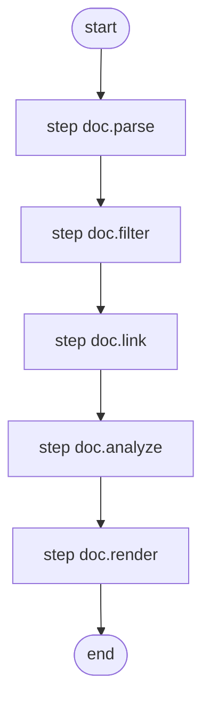

#### Flow Summary

| 指標 | 値 |
|---|---|
| 処理ステップ数 | 5 |
| 分岐数 | 0 |
| エラー経路数 | 0 |
| 解析不能数 | 0 |

### coverage.generate

> `coverage.generate`

### 受け入れ条件

> このContractが担保するビジネス要求です。

- テストカバレッジレポートを生成できる

| # | 操作 | 入力 |
|---|------|------|
| 1 | `doc.parse` | sourceFiles: input.sourceFiles |
| 2 | `doc.filter` | filterIds: input.filterIds |
| 3 | `doc.link` | - |
| 4 | `doc.analyze` | enabled: true |

<!-- flow-hash: dc55991c965b071f2945f019362a697d104a6dde190695344657250eb7ca5424 -->

フローチャート (Mermaid)

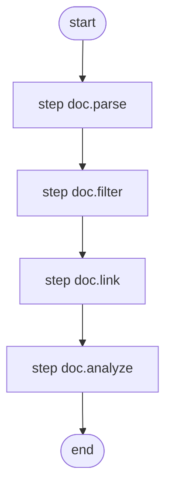

#### Flow Summary

| 指標 | 値 |
|---|---|
| 処理ステップ数 | 4 |
| 分岐数 | 0 |
| エラー経路数 | 0 |
| 解析不能数 | 0 |

### render.markdown

> `render.markdown`

### 受け入れ条件

> このContractが担保するビジネス要求です。

- タイトル・シナリオ・目次をMarkdownとして組み立てられる

| # | 操作 | 入力 |
|---|------|------|
| 1 | `render.title` | title: input.title, description: input.description |
| 2 | `render.scenarioSection` | scenarios: input.scenarios, messages: input.messages, flowEnabled: input.flowEnabled |
| 3 | `render.toc` | contracts: [...input.contracts].sort((a, b) => a.contract.name.localeCompare(b.contract.name) ), messages: input.messages |

<!-- flow-hash: 1ee36124b8efa3c2c9d5d8a9cbe87b59eae9e2bfbeef11f64d0abf10c3834f7a -->

フローチャート (Mermaid)

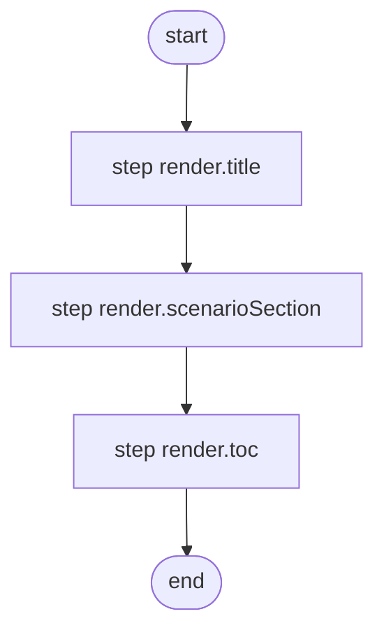

#### Flow Summary

| 指標 | 値 |
|---|---|
| 処理ステップ数 | 3 |
| 分岐数 | 0 |
| エラー経路数 | 0 |
| 解析不能数 | 0 |

### cart.normalPurchase

> `cart.normalPurchase`

### 受け入れ条件

> このContractが担保するビジネス要求です。

- ユーザーは複数のアイテムをカートに入れて購入できる

| # | 操作 | 入力 |
|---|------|------|
| 1 | `cart.create` | userId: input.userId |
| 2 | `cart.addItem` | itemId: 'apple', qty: 3, price: 1.5 |
| 3 | `cart.addItem` | itemId: 'banana', qty: 1, price: 0.8 |

<!-- flow-hash: 6cbe017fd466c86ecc80e79551c53dcf6ef9c2bafb1f43635abe77eee824c7c2 -->

フローチャート (Mermaid)

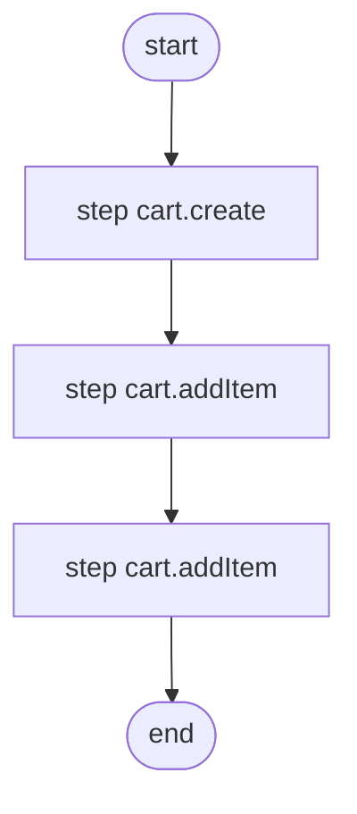

#### Flow Summary

| 指標 | 値 |
|---|---|
| 処理ステップ数 | 3 |
| 分岐数 | 0 |
| エラー経路数 | 0 |
| 解析不能数 | 0 |

### cart.duplicateCreate

> `cart.duplicateCreate`

| # | 操作 | 入力 |
|---|------|------|
| 1 | `cart.create` | userId: input.userId |
| 2 | `cart.create` | userId: input.userId |

<!-- flow-hash: 87683774917bf1870d9be3e86bc7aba05d71ae179df925f12420655bcf68532e -->

フローチャート (Mermaid)

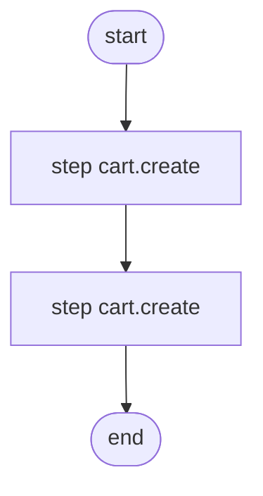

#### Flow Summary

| 指標 | 値 |
|---|---|
| 処理ステップ数 | 2 |
| 分岐数 | 0 |
| エラー経路数 | 0 |
| 解析不能数 | 0 |

## 目次

- **cart.addItem** （事前条件: 2件, テスト: 0件）
- **cart.addItem** （事前条件: 2件, テスト: 0件）
- **cart.create** （事前条件: 1件, テスト: 0件）
- **cart.create** （事前条件: 1件, テスト: 0件）
- **cart.removeItem** （事前条件: 2件, テスト: 0件）
- **doc.analyze** （事前条件: 0件, テスト: 4件）
- **doc.filter** （事前条件: 0件, テスト: 4件）
- **doc.link** （事前条件: 0件, テスト: 2件）
- **doc.parse** （事前条件: 2件, テスト: 8件）
- **doc.render** （事前条件: 0件, テスト: 3件）
- **render.scenarioSection** （事前条件: 0件, テスト: 2件）
- **render.title** （事前条件: 1件, テスト: 3件）
- **render.toc** （事前条件: 0件, テスト: 3件）
- **report.replay** （事前条件: 1件, テスト: 4件）
- **report.summary** （事前条件: 1件, テスト: 5件）

---

## Contract詳細

---

## cart.addItem

### 受け入れ条件

> このContractが担保するビジネス要求です。

- カートに新しいアイテムを追加できる

| 項目 | 型 |
|------|-----|
| 状態 (State) | `CartState` |
| 入力 (Input) | `{ itemId: string; qty: number; price: number }` |
| エラー (Error) | `CartNotFound | DuplicateItem` |

<!-- flow-hash: c516a3e1888d3ab8dbdfe573dff06504fb64caad400cd8de9c645217f5b005de -->

フローチャート (Mermaid)

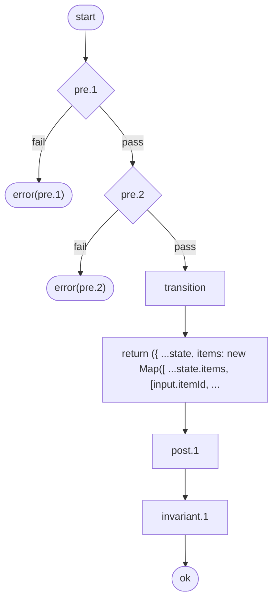

#### Flow Summary

| 指標 | 値 |
|---|---|
| 処理ステップ数 | 6 |
| 分岐数 | 0 |
| エラー経路数 | 2 |
| 解析不能数 | 0 |

### 事前条件

> この処理を実行する前に満たされている必要がある条件です。条件を満たさない場合、対応するエラーが返されます。

| # | 条件 | エラー |
|---|------|--------|
| 1 | カートが存在していること | `CartNotFound` |
| 2 | 同じアイテムが既にカートに存在していないこと | `DuplicateItem` |

### 事後条件

> この処理が正常に完了した後に保証される条件です。

| # | 条件 |
|---|------|
| 1 | アイテム数が1つ増加する |

### 不変条件

> この処理の前後を問わず、常に成り立つべき条件です。

| # | 条件 |
|---|------|
| 1 | すべてのアイテムの数量が正の値である |

### エラー一覧

| エラータグ | 発生元 |
|-----------|--------|
| `CartNotFound` | 事前条件 #1 |
| `DuplicateItem` | 事前条件 #2 |

### テストケース

> この処理の動作を検証するテストシナリオです。

_テストが見つかりません。`describe('contract.id', ...)` ブロックを追加してください。_

---

## cart.addItem

| 項目 | 型 |
|------|-----|
| 状態 (State) | `CartState` |
| 入力 (Input) | `{ itemId: string; qty: number; price: number }` |
| エラー (Error) | `CartNotFound | DuplicateItem` |

<!-- flow-hash: 0e4dc7597c052ac9704a9949fbdcae95bff45d79ef687b26d2ba8348c888320b -->

フローチャート (Mermaid)

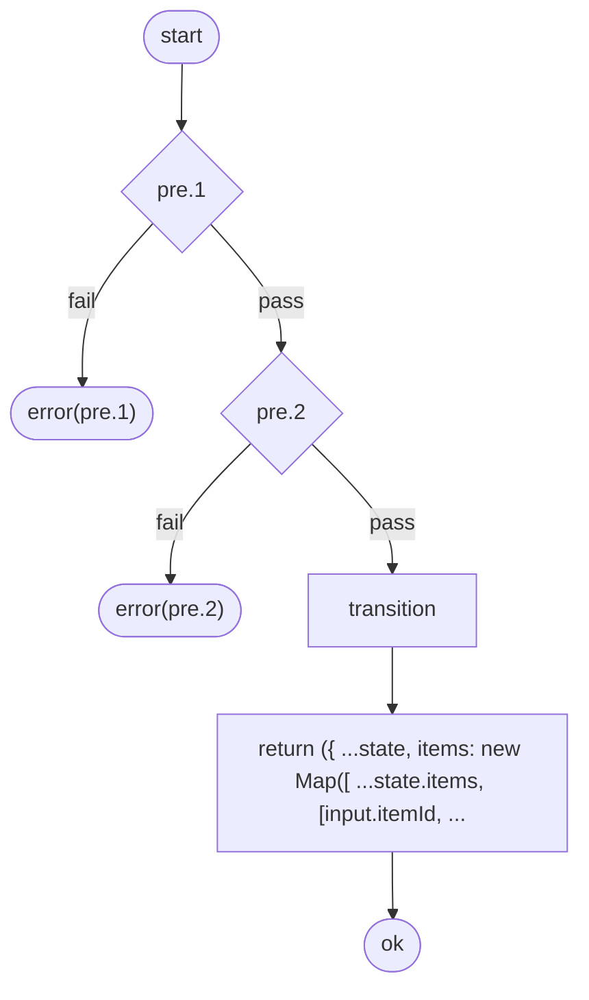

#### Flow Summary

| 指標 | 値 |
|---|---|
| 処理ステップ数 | 4 |
| 分岐数 | 0 |
| エラー経路数 | 2 |
| 解析不能数 | 0 |

### 事前条件

> この処理を実行する前に満たされている必要がある条件です。条件を満たさない場合、対応するエラーが返されます。

| # | 条件 | エラー |
|---|------|--------|
| 1 | カートが存在していること | `CartNotFound` |
| 2 | 同じアイテムが既にカートに存在していないこと | `DuplicateItem` |

### 事後条件

> この処理が正常に完了した後に保証される条件です。

_定義なし_

### 不変条件

> この処理の前後を問わず、常に成り立つべき条件です。

_定義なし_

### エラー一覧

| エラータグ | 発生元 |
|-----------|--------|
| `CartNotFound` | 事前条件 #1 |
| `DuplicateItem` | 事前条件 #2 |

### テストケース

> この処理の動作を検証するテストシナリオです。

_テストが見つかりません。`describe('contract.id', ...)` ブロックを追加してください。_

---

## cart.create

### 受け入れ条件

> このContractが担保するビジネス要求です。

- ユーザーは新しいカートを作成できる
- 既にカートが存在する場合はエラーが返される

| 項目 | 型 |
|------|-----|
| 状態 (State) | `CartState` |
| 入力 (Input) | `{ userId: string }` |
| エラー (Error) | `AlreadyExists` |

<!-- flow-hash: a7ef477891c350e9cd81da799c2e25b7226285250f4476559d43fdaf3c92e46f -->

フローチャート (Mermaid)

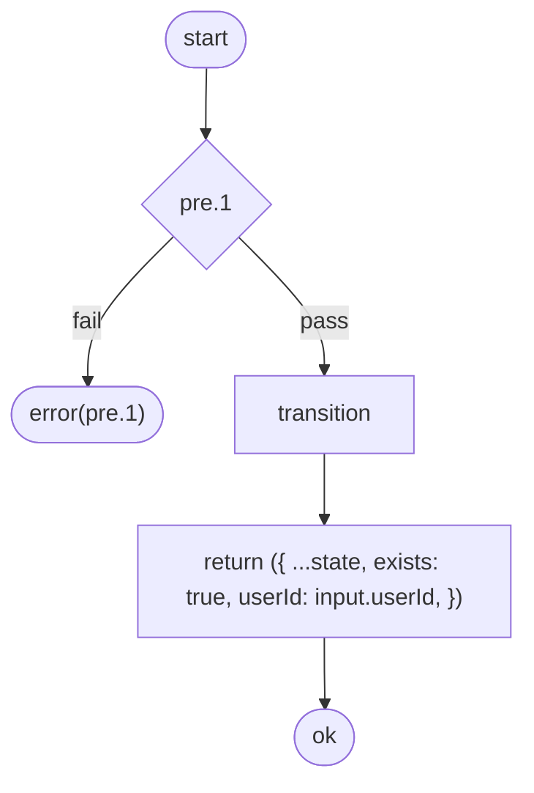

#### Flow Summary

| 指標 | 値 |
|---|---|
| 処理ステップ数 | 3 |
| 分岐数 | 0 |
| エラー経路数 | 1 |
| 解析不能数 | 0 |

### 事前条件

> この処理を実行する前に満たされている必要がある条件です。条件を満たさない場合、対応するエラーが返されます。

| # | 条件 | エラー |
|---|------|--------|
| 1 | カートがまだ存在していないこと | `AlreadyExists` |

### 事後条件

> この処理が正常に完了した後に保証される条件です。

_定義なし_

### 不変条件

> この処理の前後を問わず、常に成り立つべき条件です。

_定義なし_

### エラー一覧

| エラータグ | 発生元 |
|-----------|--------|
| `AlreadyExists` | 事前条件 #1 |

### テストケース

> この処理の動作を検証するテストシナリオです。

_テストが見つかりません。`describe('contract.id', ...)` ブロックを追加してください。_

---

## cart.create

| 項目 | 型 |
|------|-----|
| 状態 (State) | `CartState` |
| 入力 (Input) | `{ userId: string }` |
| エラー (Error) | `AlreadyExists` |

<!-- flow-hash: 0a0ca4513a0d3fdbcedb031f935bae4cad8e7dbf88c1816a4886afc99d51c57b -->

フローチャート (Mermaid)

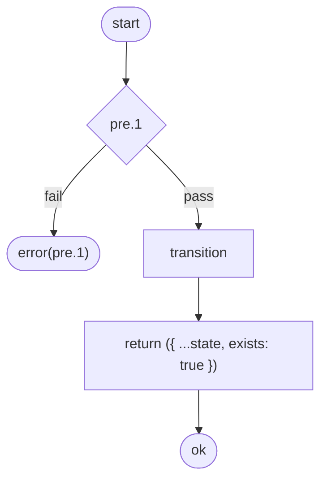

#### Flow Summary

| 指標 | 値 |
|---|---|
| 処理ステップ数 | 3 |
| 分岐数 | 0 |
| エラー経路数 | 1 |
| 解析不能数 | 0 |

### 事前条件

> この処理を実行する前に満たされている必要がある条件です。条件を満たさない場合、対応するエラーが返されます。

| # | 条件 | エラー |
|---|------|--------|
| 1 | カートがまだ存在していないこと | `AlreadyExists` |

### 事後条件

> この処理が正常に完了した後に保証される条件です。

_定義なし_

### 不変条件

> この処理の前後を問わず、常に成り立つべき条件です。

_定義なし_

### エラー一覧

| エラータグ | 発生元 |
|-----------|--------|
| `AlreadyExists` | 事前条件 #1 |

### テストケース

> この処理の動作を検証するテストシナリオです。

_テストが見つかりません。`describe('contract.id', ...)` ブロックを追加してください。_

---

## cart.removeItem

| 項目 | 型 |
|------|-----|
| 状態 (State) | `CartState` |
| 入力 (Input) | `{ itemId: string }` |
| エラー (Error) | `CartNotFound | ItemNotFound` |

<!-- flow-hash: b088a8d82e1b0167042109d1d59bd5041a70f47a28e632bcb48f315ba788f27e -->

フローチャート (Mermaid)

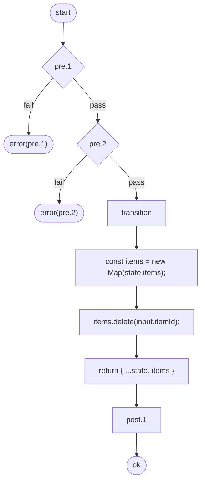

#### Flow Summary

| 指標 | 値 |
|---|---|
| 処理ステップ数 | 7 |
| 分岐数 | 0 |
| エラー経路数 | 2 |
| 解析不能数 | 0 |

### 事前条件

> この処理を実行する前に満たされている必要がある条件です。条件を満たさない場合、対応するエラーが返されます。

| # | 条件 | エラー |
|---|------|--------|
| 1 | カートが存在していること | `CartNotFound` |
| 2 | アイテムが存在していること | `ItemNotFound` |

### 事後条件

> この処理が正常に完了した後に保証される条件です。

| # | 条件 |
|---|------|
| 1 | アイテム数が1つ減少する |

### 不変条件

> この処理の前後を問わず、常に成り立つべき条件です。

_定義なし_

### エラー一覧

| エラータグ | 発生元 |
|-----------|--------|
| `CartNotFound` | 事前条件 #1 |
| `ItemNotFound` | 事前条件 #2 |

### テストケース

> この処理の動作を検証するテストシナリオです。

_テストが見つかりません。`describe('contract.id', ...)` ブロックを追加してください。_

---

## doc.analyze

### 受け入れ条件

> このContractが担保するビジネス要求です。

- テストカバレッジを分析してレポートを生成できる

| 項目 | 型 |
|------|-----|
| 状態 (State) | `DocPipelineState` |
| 入力 (Input) | `AnalyzeInput` |
| エラー (Error) | `never` |

<!-- flow-hash: 41aa4524f7302e91f31bf9133af3a4d1b34a71ee1f05dc834c58bfae2a38a3b3 -->

フローチャート (Mermaid)

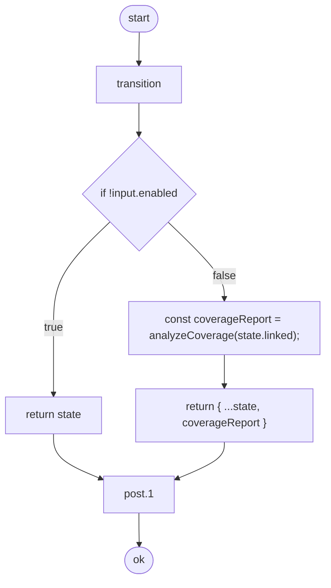

#### Flow Summary

| 指標 | 値 |
|---|---|
| 処理ステップ数 | 6 |
| 分岐数 | 1 |
| エラー経路数 | 0 |
| 解析不能数 | 0 |

### 事前条件

> この処理を実行する前に満たされている必要がある条件です。条件を満たさない場合、対応するエラーが返されます。

_定義なし_

### 事後条件

> この処理が正常に完了した後に保証される条件です。

| # | 条件 |
|---|------|
| 1 | coverage report is present when analysis is enabled |

### 不変条件

> この処理の前後を問わず、常に成り立つべき条件です。

_定義なし_

### エラー一覧

_エラー定義なし_

### テストケース

> この処理の動作を検証するテストシナリオです。

| # | シナリオ | 期待結果 |
|---|---------|---------|
| 1 | generates coverage report when enabled | 正常に処理される |
| 2 | skips coverage when disabled | 正常に処理される |
| 3 | post/invariant: hold when enabled | 正常に処理される |
| 4 | post/invariant: hold when disabled | 正常に処理される |

---

## doc.filter

### 受け入れ条件

> このContractが担保するビジネス要求です。

- 指定されたIDでContractをフィルタリングできる

| 項目 | 型 |
|------|-----|
| 状態 (State) | `DocPipelineState` |
| 入力 (Input) | `FilterInput` |
| エラー (Error) | `never` |

<!-- flow-hash: 3225329e243f73cc9b79acccd0841fa71fcfa8fabbf564e8e659ea6faf930bbf -->

フローチャート (Mermaid)

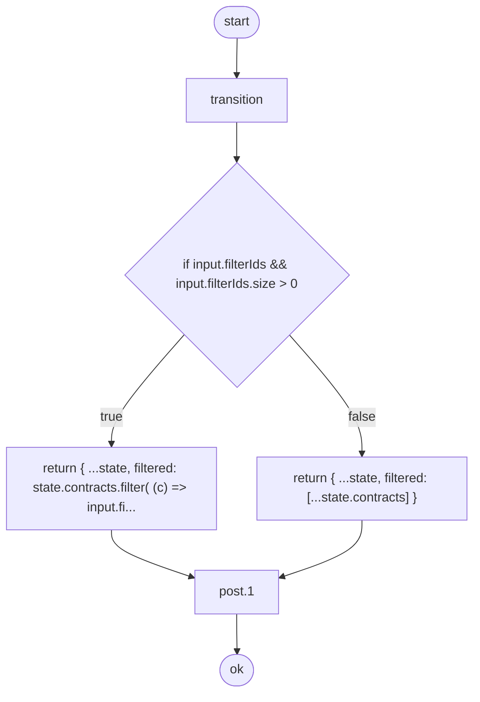

#### Flow Summary

| 指標 | 値 |
|---|---|
| 処理ステップ数 | 5 |
| 分岐数 | 1 |
| エラー経路数 | 0 |
| 解析不能数 | 0 |

### 事前条件

> この処理を実行する前に満たされている必要がある条件です。条件を満たさない場合、対応するエラーが返されます。

_定義なし_

### 事後条件

> この処理が正常に完了した後に保証される条件です。

| # | 条件 |
|---|------|
| 1 | filtered contracts are a subset of all contracts |

### 不変条件

> この処理の前後を問わず、常に成り立つべき条件です。

_定義なし_

### エラー一覧

_エラー定義なし_

### テストケース

> この処理の動作を検証するテストシナリオです。

| # | シナリオ | 期待結果 |
|---|---------|---------|
| 1 | filters contracts by IDs | 正常に処理される |
| 2 | passes all contracts when no filter | 正常に処理される |
| 3 | returns empty when filter matches nothing | 正常に処理される |
| 4 | post/invariant: hold after transition | 正常に処理される |

---

## doc.link

### 受け入れ条件

> このContractが担保するビジネス要求です。

- Contractとテストスイートを紐付けできる

| 項目 | 型 |
|------|-----|
| 状態 (State) | `DocPipelineState` |
| 入力 (Input) | `Record<string, never>` |
| エラー (Error) | `never` |

<!-- flow-hash: 1a4eefd6f3f3cc1c3bd189690b70b805e5b4ee7bde32777c1ea0682823149ecd -->

フローチャート (Mermaid)

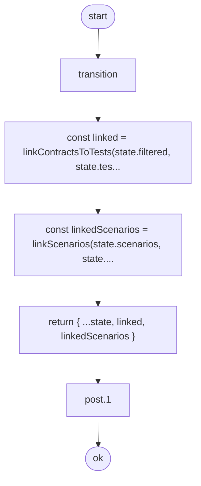

#### Flow Summary

| 指標 | 値 |
|---|---|
| 処理ステップ数 | 5 |
| 分岐数 | 0 |
| エラー経路数 | 0 |
| 解析不能数 | 0 |

### 事前条件

> この処理を実行する前に満たされている必要がある条件です。条件を満たさない場合、対応するエラーが返されます。

_定義なし_

### 事後条件

> この処理が正常に完了した後に保証される条件です。

| # | 条件 |
|---|------|
| 1 | every filtered contract has a corresponding linked entry |

### 不変条件

> この処理の前後を問わず、常に成り立つべき条件です。

_定義なし_

### エラー一覧

_エラー定義なし_

### テストケース

> この処理の動作を検証するテストシナリオです。

| # | シナリオ | 期待結果 |
|---|---------|---------|
| 1 | links contracts to tests | 正常に処理される |
| 2 | post/invariant: hold after transition | 正常に処理される |

---

## doc.parse

### 受け入れ条件

> このContractが担保するビジネス要求です。

- ソースファイルからContract・Scenario・テストをパースできる
- ソースファイルが未指定の場合はエラーを返す

| 項目 | 型 |
|------|-----|
| 状態 (State) | `DocPipelineState` |
| 入力 (Input) | `ParseInput` |
| エラー (Error) | `PipelineError` |

<!-- flow-hash: d76f606ef632fca1a6ff64b8a89cd0bb9b0956c21d586d14e5440fc882cac9fd -->

フローチャート (Mermaid)

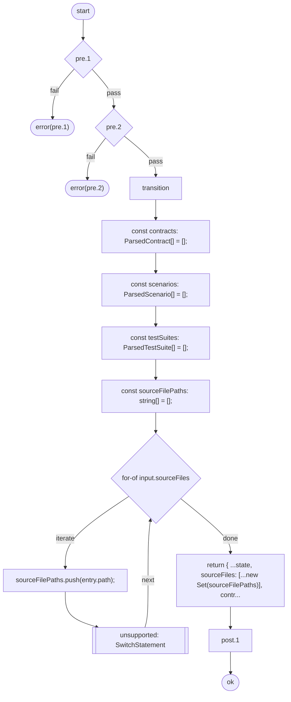

#### Flow Summary

| 指標 | 値 |
|---|---|
| 処理ステップ数 | 11 |
| 分岐数 | 1 |
| エラー経路数 | 2 |
| 解析不能数 | 1 |

> 注意: 未対応構文により 1 件の解析不能経路があります。

### 事前条件

> この処理を実行する前に満たされている必要がある条件です。条件を満たさない場合、対応するエラーが返されます。

| # | 条件 | エラー |
|---|------|--------|
| 1 | source files must not be empty | `NoSourceFiles` |
| 2 | scenario flow must be deterministic | `DynamicScenarioFlow` |

### 事後条件

> この処理が正常に完了した後に保証される条件です。

| # | 条件 |
|---|------|
| 1 | source file paths are tracked uniquely |

### 不変条件

> この処理の前後を問わず、常に成り立つべき条件です。

_定義なし_

### エラー一覧

| エラータグ | 発生元 |
|-----------|--------|
| `NoSourceFiles` | 事前条件 #1 |
| `DynamicScenarioFlow` | 事前条件 #2 |

### テストケース

> この処理の動作を検証するテストシナリオです。

| # | シナリオ | 期待結果 |
|---|---------|---------|
| 1 | parses contracts from source files | 正常に処理される |
| 2 | parses test suites from source files | 正常に処理される |
| 3 | rejects empty source files | エラーが返される |
| 4 | rejects dynamic scenario flow patterns | エラーが返される |
| 5 | rejects non-direct step elements in scenario flow arrays | エラーが返される |
| 6 | preserves title and messages | 正常に処理される |
| 7 | post/invariant: hold after transition | - |
| 8 | exposes contract metadata | - |

---

## doc.render

### 受け入れ条件

> このContractが担保するビジネス要求です。

- パイプライン状態からMarkdownドキュメントを生成できる

| 項目 | 型 |
|------|-----|
| 状態 (State) | `DocPipelineState` |
| 入力 (Input) | `Record<string, never>` |
| エラー (Error) | `never` |

<!-- flow-hash: 25f767374f8d93c02b82ca9da521e0b85455cb10324ae3a0a9f0e3e90f6f80de -->

フローチャート (Mermaid)

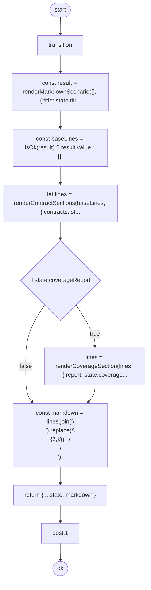

#### Flow Summary

| 指標 | 値 |
|---|---|
| 処理ステップ数 | 9 |
| 分岐数 | 1 |
| エラー経路数 | 0 |
| 解析不能数 | 0 |

### 事前条件

> この処理を実行する前に満たされている必要がある条件です。条件を満たさない場合、対応するエラーが返されます。

_定義なし_

### 事後条件

> この処理が正常に完了した後に保証される条件です。

| # | 条件 |
|---|------|
| 1 | non-empty linked state produces non-empty markdown |

### 不変条件

> この処理の前後を問わず、常に成り立つべき条件です。

_定義なし_

### エラー一覧

_エラー定義なし_

### テストケース

> この処理の動作を検証するテストシナリオです。

| # | シナリオ | 期待結果 |
|---|---------|---------|
| 1 | renders markdown from linked state | 正常に処理される |
| 2 | renders title-only markdown for empty state | 正常に処理される |
| 3 | post/invariant: hold after transition | 正常に処理される |

---

## render.scenarioSection

### 受け入れ条件

> このContractが担保するビジネス要求です。

- シナリオセクションをレンダリングできる

| 項目 | 型 |
|------|-----|
| 状態 (State) | `readonly string[]` |
| 入力 (Input) | `ScenarioSectionInput` |
| エラー (Error) | `RenderError` |

<!-- flow-hash: 22883c1b1c8b31d57955c89e7fa127cd42ce14de6b88079570b4400fc30265b0 -->

フローチャート (Mermaid)

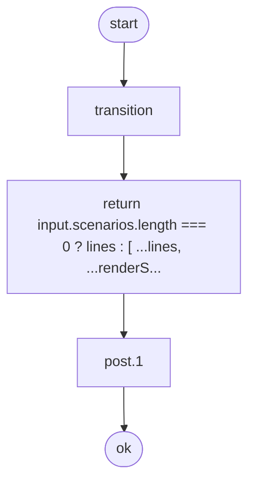

#### Flow Summary

| 指標 | 値 |
|---|---|
| 処理ステップ数 | 3 |
| 分岐数 | 0 |
| エラー経路数 | 0 |
| 解析不能数 | 0 |

### 事前条件

> この処理を実行する前に満たされている必要がある条件です。条件を満たさない場合、対応するエラーが返されます。

_定義なし_

### 事後条件

> この処理が正常に完了した後に保証される条件です。

| # | 条件 |
|---|------|
| 1 | rendering scenario section appends lines only when scenarios exist |

### 不変条件

> この処理の前後を問わず、常に成り立つべき条件です。

_定義なし_

### エラー一覧

_エラー定義なし_

### テストケース

> この処理の動作を検証するテストシナリオです。

| # | シナリオ | 期待結果 |
|---|---------|---------|
| 1 | renders scenario section | 正常に処理される |
| 2 | skips scenario section when scenarios are empty | 正常に処理される |

---

## render.title

### 受け入れ条件

> このContractが担保するビジネス要求です。

- ドキュメントのタイトルと説明をレンダリングできる

| 項目 | 型 |
|------|-----|
| 状態 (State) | `readonly string[]` |
| 入力 (Input) | `TitleInput` |
| エラー (Error) | `RenderError` |

<!-- flow-hash: 754aa1b5d9622b61e90d3f9cabb9b3350e30191690587365dddec4a4b51af881 -->

フローチャート (Mermaid)

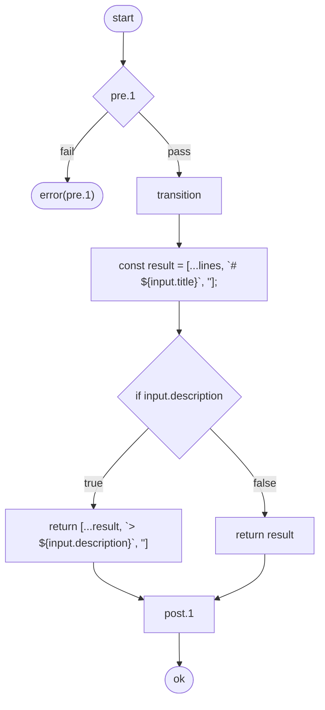

#### Flow Summary

| 指標 | 値 |
|---|---|
| 処理ステップ数 | 7 |
| 分岐数 | 1 |
| エラー経路数 | 1 |
| 解析不能数 | 0 |

### 事前条件

> この処理を実行する前に満たされている必要がある条件です。条件を満たさない場合、対応するエラーが返されます。

| # | 条件 | エラー |
|---|------|--------|
| 1 | document title must not be empty | `TitleEmpty` |

### 事後条件

> この処理が正常に完了した後に保証される条件です。

| # | 条件 |
|---|------|
| 1 | rendering a title always appends new lines |

### 不変条件

> この処理の前後を問わず、常に成り立つべき条件です。

_定義なし_

### エラー一覧

| エラータグ | 発生元 |
|-----------|--------|
| `TitleEmpty` | 事前条件 #1 |

### テストケース

> この処理の動作を検証するテストシナリオです。

| # | シナリオ | 期待結果 |
|---|---------|---------|
| 1 | renders title with description | 正常に処理される |
| 2 | rejects empty title | エラーが返される |
| 3 | post: lines increase after transition | - |

---

## render.toc

### 受け入れ条件

> このContractが担保するビジネス要求です。

- 2つ以上のContractがある場合に目次を生成できる

| 項目 | 型 |
|------|-----|
| 状態 (State) | `readonly string[]` |
| 入力 (Input) | `TocInput` |
| エラー (Error) | `RenderError` |

<!-- flow-hash: c0cd15cdc9468232f6084c7afd4b1388bfbbe19b365b2a0d4b697de53397c082 -->

フローチャート (Mermaid)

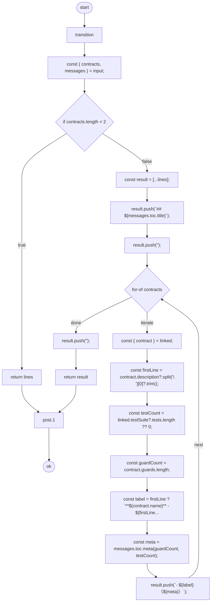

#### Flow Summary

| 指標 | 値 |
|---|---|
| 処理ステップ数 | 18 |
| 分岐数 | 2 |
| エラー経路数 | 0 |
| 解析不能数 | 0 |

### 事前条件

> この処理を実行する前に満たされている必要がある条件です。条件を満たさない場合、対応するエラーが返されます。

_定義なし_

### 事後条件

> この処理が正常に完了した後に保証される条件です。

| # | 条件 |
|---|------|
| 1 | rendering TOC appends lines only when two or more contracts are present |

### 不変条件

> この処理の前後を問わず、常に成り立つべき条件です。

_定義なし_

### エラー一覧

_エラー定義なし_

### テストケース

> この処理の動作を検証するテストシナリオです。

| # | シナリオ | 期待結果 |
|---|---------|---------|
| 1 | renders TOC for 2+ contracts | 正常に処理される |
| 2 | skips TOC when fewer than 2 contracts | 正常に処理される |
| 3 | post: lines increase after transition | - |

---

## report.replay

### 受け入れ条件

> このContractが担保するビジネス要求です。

- 失敗したPBT検証のリプレイコマンドを生成できる

| 項目 | 型 |
|------|-----|
| 状態 (State) | `string` |
| 入力 (Input) | `ReporterInput` |
| エラー (Error) | `ReporterError` |

<!-- flow-hash: bfe9749c6cef33bc00c7c7260ec1e97efae5e707b9433a56ef908517c4c64f3f -->

フローチャート (Mermaid)

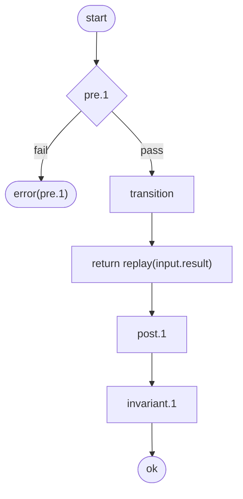

#### Flow Summary

| 指標 | 値 |
|---|---|
| 処理ステップ数 | 5 |
| 分岐数 | 0 |
| エラー経路数 | 1 |
| 解析不能数 | 0 |

### 事前条件

> この処理を実行する前に満たされている必要がある条件です。条件を満たさない場合、対応するエラーが返されます。

| # | 条件 | エラー |
|---|------|--------|
| 1 | must have at least one failure to generate replay | `NoFailures` |

### 事後条件

> この処理が正常に完了した後に保証される条件です。

| # | 条件 |
|---|------|
| 1 | output is non-empty |

### 不変条件

> この処理の前後を問わず、常に成り立つべき条件です。

| # | 条件 |
|---|------|
| 1 | output is always a string |

### エラー一覧

| エラータグ | 発生元 |
|-----------|--------|
| `NoFailures` | 事前条件 #1 |

### テストケース

> この処理の動作を検証するテストシナリオです。

| # | シナリオ | 期待結果 |
|---|---------|---------|
| 1 | formats failed result | 正常に処理される |
| 2 | rejects successful result | エラーが返される |
| 3 | post/invariant: hold after transition | - |
| 4 | exposes contract metadata | - |

---

## report.summary

### 受け入れ条件

> このContractが担保するビジネス要求です。

- PBT検証結果のサマリーレポートを生成できる

| 項目 | 型 |
|------|-----|
| 状態 (State) | `string` |
| 入力 (Input) | `ReporterInput` |
| エラー (Error) | `ReporterError` |

<!-- flow-hash: dc24903e89b1cfeaaa41b000bc2d65265126f95340f36a6a313f6ee66716036d -->

フローチャート (Mermaid)

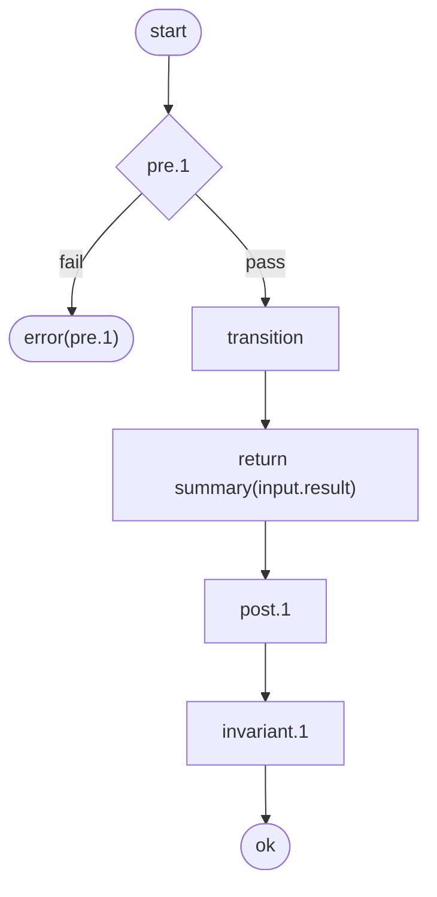

#### Flow Summary

| 指標 | 値 |
|---|---|
| 処理ステップ数 | 5 |
| 分岐数 | 0 |
| エラー経路数 | 1 |
| 解析不能数 | 0 |

### 事前条件

> この処理を実行する前に満たされている必要がある条件です。条件を満たさない場合、対応するエラーが返されます。

| # | 条件 | エラー |
|---|------|--------|
| 1 | verification results must not be empty | `NoResults` |

### 事後条件

> この処理が正常に完了した後に保証される条件です。

| # | 条件 |
|---|------|
| 1 | output contains seizu-verify header |

### 不変条件

> この処理の前後を問わず、常に成り立つべき条件です。

| # | 条件 |
|---|------|
| 1 | output is always a string |

### エラー一覧

| エラータグ | 発生元 |
|-----------|--------|
| `NoResults` | 事前条件 #1 |

### テストケース

> この処理の動作を検証するテストシナリオです。

| # | シナリオ | 期待結果 |
|---|---------|---------|
| 1 | formats passing result | 正常に処理される |
| 2 | formats result with multiple contracts | 正常に処理される |
| 3 | rejects empty results | エラーが返される |
| 4 | post/invariant: hold after transition | - |
| 5 | exposes contract metadata | - |

---

## テスト網羅性

> 各Contractに対するテストの網羅状況です。

| Contract | テスト数 | エラータグ網羅 | 状態 |
|----------|-------|---------------|--------|
| doc.parse | 8 | 0/2 | テスト済 |
| doc.filter | 4 | - | テスト済 |
| doc.link | 2 | - | テスト済 |
| doc.analyze | 4 | - | テスト済 |
| doc.render | 3 | - | テスト済 |
| render.title | 3 | 0/1 | テスト済 |
| render.toc | 3 | - | テスト済 |
| render.scenarioSection | 2 | - | テスト済 |
| report.summary | 5 | 0/1 | テスト済 |
| report.replay | 4 | 0/1 | テスト済 |
| cart.create | 0 | 0/1 | 未テスト |
| cart.addItem | 0 | 0/2 | 未テスト |
| cart.removeItem | 0 | 0/2 | 未テスト |
| cart.create | 0 | 0/1 | 未テスト |
| cart.addItem | 0 | 0/2 | 未テスト |

Contract網羅率: 10/15 (66.7%)
エラータグ網羅率: 0/13 (0.0%)
