# kata-cli Contract Specification

> kata-cli domain logic contracts — self-documenting dogfooding example

## Scenarios

> Business workflows composed from multiple contract operations.

### ドキュメント生成パイプライン

> `doc.generate`

| # | Operation | Input |
|---|------|------|
| 1 | `doc.parse` | sourceFiles: input.sourceFiles |
| 2 | `doc.filter` | filterIds: input.filterIds |
| 3 | `doc.link` | - |
| 4 | `doc.analyze` | enabled: input.coverageEnabled |
| 5 | `doc.render` | - |

<!-- flow-hash: e2aa910ce0e8b6c8994bc92f6872b816f8d6ea26f7315b895eb86d20e89922c4 -->

Flowchart (Mermaid)

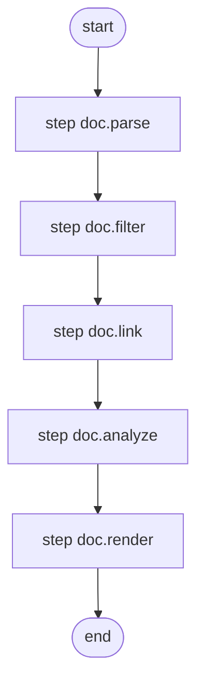

#### Flow Summary

| Metric | Value |
|---|---|
| Processing steps | 5 |
| Branch count | 0 |
| Error path count | 0 |
| Unanalyzable count | 0 |

### Markdown ドキュメント全体の組み立て

> `render.markdown`

| # | Operation | Input |
|---|------|------|
| 1 | `render.title` | title: input.title, description: input.description |
| 2 | `render.scenarioSection` | scenarios: input.scenarios, messages: input.messages, flowEnabled: input.flowEnabled |
| 3 | `render.toc` | contracts: sorted, messages: input.messages |
| 4 | `render.contractDetail` | contracts: input.contracts, hasScenarios: input.scenarios.length > 0, messages: input.messages, flowEnabled: input.flowEnabled |
| 5 | `render.coverageSummary` | report: input.coverageReport, messages: input.messages |

<!-- flow-hash: 4e7c379308fd4d5d99d9c2ec3a46e6fbbbd8a18bbf6b48bfc84e7fa8b2b103fc -->

Flowchart (Mermaid)

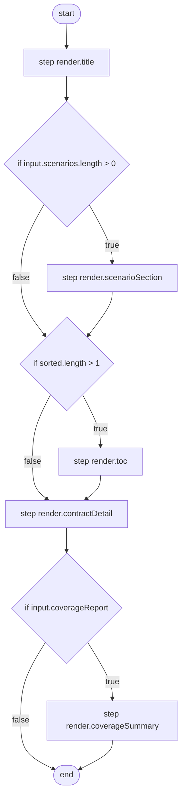

#### Flow Summary

| Metric | Value |
|---|---|
| Processing steps | 8 |
| Branch count | 3 |
| Error path count | 0 |
| Unanalyzable count | 0 |

## Table of Contents

- **doc.analyze** （Preconditions: 0, Tests: 4）
- **doc.filter** （Preconditions: 0, Tests: 4）
- **doc.link** （Preconditions: 0, Tests: 2）
- **doc.parse** （Preconditions: 1, Tests: 6）
- **doc.render** （Preconditions: 0, Tests: 3）
- **render.contractDetail** （Preconditions: 0, Tests: 5）
- **render.contractHeader** （Preconditions: 1, Tests: 3）
- **render.coverageSummary** （Preconditions: 0, Tests: 2）
- **render.errorCatalog** （Preconditions: 0, Tests: 3）
- **render.invariants** （Preconditions: 0, Tests: 2）
- **render.postconditions** （Preconditions: 0, Tests: 2）
- **render.preconditions** （Preconditions: 0, Tests: 3）
- **render.scenarioSection** （Preconditions: 1, Tests: 3）
- **render.testExamples** （Preconditions: 0, Tests: 3）
- **render.title** （Preconditions: 1, Tests: 6）
- **render.toc** （Preconditions: 1, Tests: 3）
- **report.replay** （Preconditions: 1, Tests: 4）
- **report.summary** （Preconditions: 1, Tests: 5）

---

## Contract Details

---

## doc.analyze

| Property | Type |
|------|-----|
| State | `DocPipelineState` |
| Input | `AnalyzeInput` |
| Error | `never` |

<!-- flow-hash: c21f2533f99223960c9abe789d4d3c3a520e62e04ffca7b4de70695c0dda0461 -->

Flowchart (Mermaid)

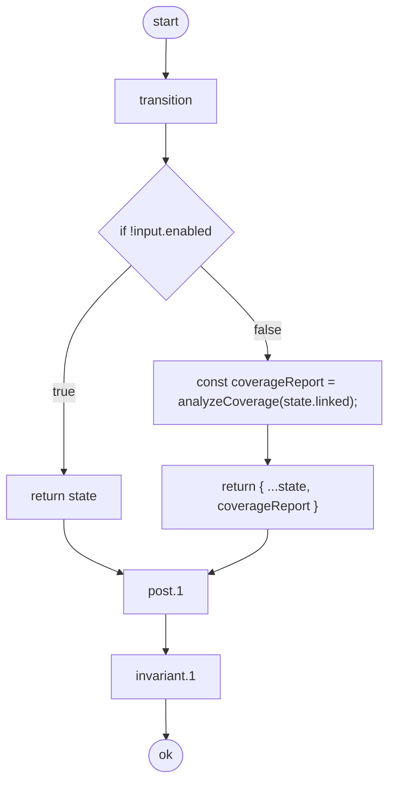

#### Flow Summary

| Metric | Value |
|---|---|
| Processing steps | 7 |
| Branch count | 1 |
| Error path count | 0 |
| Unanalyzable count | 0 |

### Preconditions

> Conditions that must be satisfied before this operation can execute. If a condition is not met, the corresponding error is returned.

_Not defined_

### Postconditions

> Conditions guaranteed to hold after this operation completes successfully.

| # | Condition |
|---|------|
| 1 | Coverage report is present when analysis is enabled |

### Invariants

> Conditions that must hold both before and after this operation.

| # | Condition |
|---|------|
| 1 | Linked contracts are preserved |

### Error Catalog

_No errors defined_

### Test Cases

> Test scenarios that verify the behavior of this operation.

| # | Scenario | Expected Result |
|---|---------|---------|
| 1 | generates coverage report when enabled | Succeeds |
| 2 | skips coverage when disabled | Succeeds |
| 3 | post/invariant: hold when enabled | Succeeds |
| 4 | post/invariant: hold when disabled | Succeeds |

---

## doc.filter

| Property | Type |
|------|-----|
| State | `DocPipelineState` |
| Input | `FilterInput` |
| Error | `never` |

<!-- flow-hash: 7a9be1ac6749452fab1fdb9b51bf25798e8fdfce2f874a6959fad1540d0a5d92 -->

Flowchart (Mermaid)

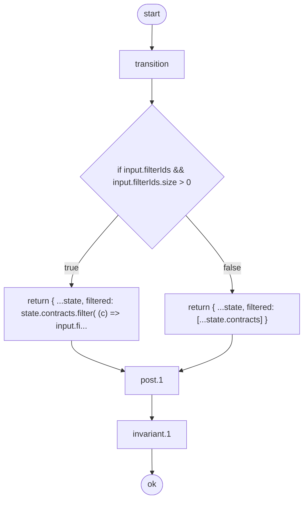

#### Flow Summary

| Metric | Value |
|---|---|
| Processing steps | 6 |
| Branch count | 1 |
| Error path count | 0 |
| Unanalyzable count | 0 |

### Preconditions

> Conditions that must be satisfied before this operation can execute. If a condition is not met, the corresponding error is returned.

_Not defined_

### Postconditions

> Conditions guaranteed to hold after this operation completes successfully.

| # | Condition |
|---|------|
| 1 | Filtered contracts are a subset of all contracts |

### Invariants

> Conditions that must hold both before and after this operation.

| # | Condition |
|---|------|
| 1 | Title is preserved |

### Error Catalog

_No errors defined_

### Test Cases

> Test scenarios that verify the behavior of this operation.

| # | Scenario | Expected Result |
|---|---------|---------|
| 1 | filters contracts by IDs | Succeeds |
| 2 | passes all contracts when no filter | Succeeds |
| 3 | returns empty when filter matches nothing | Succeeds |
| 4 | post/invariant: hold after transition | Succeeds |

---

## doc.link

| Property | Type |
|------|-----|
| State | `DocPipelineState` |
| Input | `Record<string, never>` |
| Error | `never` |

<!-- flow-hash: 203b0284f7e24635e28a885a9fb3d0f6a127561141b52b4be98c71574bacc3df -->

Flowchart (Mermaid)

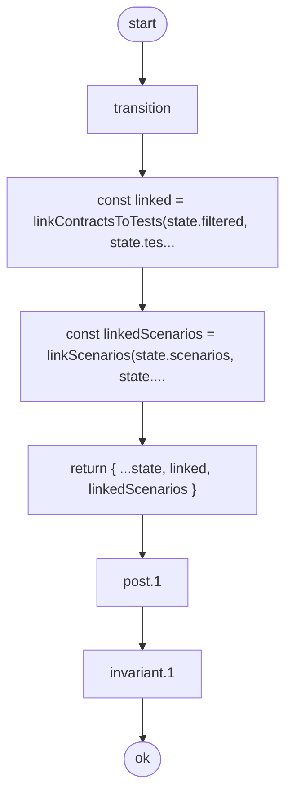

#### Flow Summary

| Metric | Value |
|---|---|
| Processing steps | 6 |
| Branch count | 0 |
| Error path count | 0 |
| Unanalyzable count | 0 |

### Preconditions

> Conditions that must be satisfied before this operation can execute. If a condition is not met, the corresponding error is returned.

_Not defined_

### Postconditions

> Conditions guaranteed to hold after this operation completes successfully.

| # | Condition |
|---|------|
| 1 | Every filtered contract has a corresponding linked entry |

### Invariants

> Conditions that must hold both before and after this operation.

| # | Condition |
|---|------|
| 1 | Filtered contracts are not lost |

### Error Catalog

_No errors defined_

### Test Cases

> Test scenarios that verify the behavior of this operation.

| # | Scenario | Expected Result |
|---|---------|---------|
| 1 | links contracts to tests | Succeeds |
| 2 | post/invariant: hold after transition | Succeeds |

---

## doc.parse

| Property | Type |
|------|-----|
| State | `DocPipelineState` |
| Input | `ParseInput` |
| Error | `PipelineError` |

<!-- flow-hash: 76f8f168478d5ad5c39adfd56a7e4a6250e52c7bc82ae88b1ec93405a5d703b8 -->

Flowchart (Mermaid)

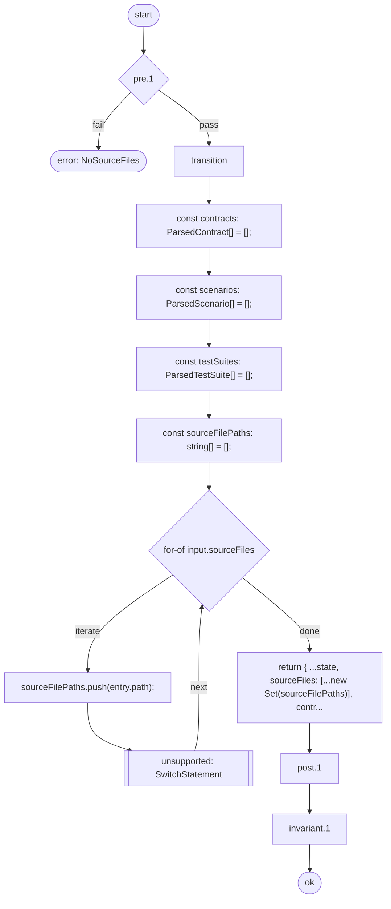

#### Flow Summary

| Metric | Value |
|---|---|
| Processing steps | 11 |
| Branch count | 1 |
| Error path count | 1 |
| Unanalyzable count | 1 |

> Warning: 1 unsupported syntax path(s) were detected.

### Preconditions

> Conditions that must be satisfied before this operation can execute. If a condition is not met, the corresponding error is returned.

| # | Condition | Error |
|---|------|--------|
| 1 | Source files must not be empty | `NoSourceFiles` |

### Postconditions

> Conditions guaranteed to hold after this operation completes successfully.

| # | Condition |
|---|------|
| 1 | Contracts and scenarios arrays are populated |

### Invariants

> Conditions that must hold both before and after this operation.

| # | Condition |
|---|------|
| 1 | Title is preserved |

### Error Catalog

| Error Tag | Source |
|-----------|--------|
| `NoSourceFiles` | Precondition #1 |

### Test Cases

> Test scenarios that verify the behavior of this operation.

| # | Scenario | Expected Result |
|---|---------|---------|
| 1 | parses contracts from source files | Succeeds |
| 2 | parses test suites from source files | Succeeds |
| 3 | rejects empty source files | Returns error |
| 4 | preserves title and messages | Succeeds |
| 5 | post/invariant: hold after transition | - |
| 6 | exposes contract metadata | - |

---

## doc.render

| Property | Type |
|------|-----|
| State | `DocPipelineState` |
| Input | `Record<string, never>` |
| Error | `never` |

<!-- flow-hash: 0f74433327bac445890346630e8e396181b88fe622eff3aad27c2c051a18fde6 -->

Flowchart (Mermaid)

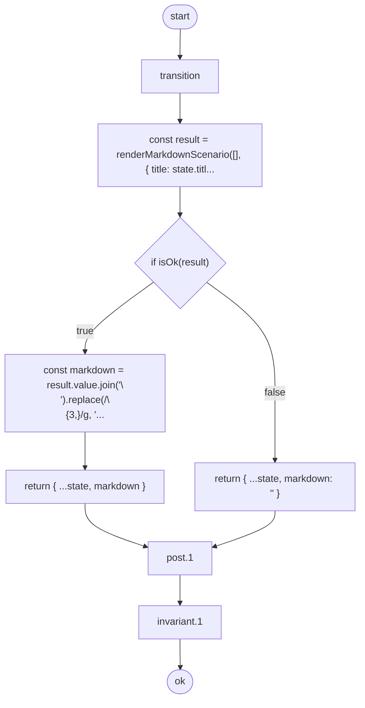

#### Flow Summary

| Metric | Value |
|---|---|
| Processing steps | 8 |
| Branch count | 1 |
| Error path count | 0 |
| Unanalyzable count | 0 |

### Preconditions

> Conditions that must be satisfied before this operation can execute. If a condition is not met, the corresponding error is returned.

_Not defined_

### Postconditions

> Conditions guaranteed to hold after this operation completes successfully.

| # | Condition |
|---|------|
| 1 | Non-empty linked state produces non-empty markdown |

### Invariants

> Conditions that must hold both before and after this operation.

| # | Condition |
|---|------|
| 1 | Title appears in markdown when contracts exist |

### Error Catalog

_No errors defined_

### Test Cases

> Test scenarios that verify the behavior of this operation.

| # | Scenario | Expected Result |
|---|---------|---------|
| 1 | renders markdown from linked state | Succeeds |
| 2 | renders title-only markdown for empty state | Succeeds |
| 3 | post/invariant: hold after transition | Succeeds |

---

## render.contractDetail

| Property | Type |
|------|-----|
| State | `readonly string[]` |
| Input | `ContractDetailInput` |
| Error | `never` |

<!-- flow-hash: f9bbed0d3935c22a071ac6add5ac0e487d0e819cfcadda67690abd8195d08919 -->

Flowchart (Mermaid)

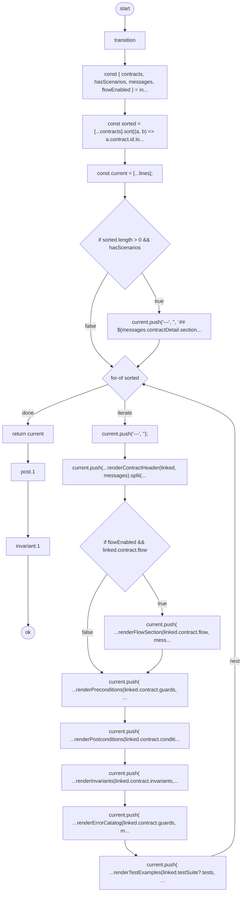

#### Flow Summary

| Metric | Value |
|---|---|
| Processing steps | 19 |
| Branch count | 3 |
| Error path count | 0 |
| Unanalyzable count | 0 |

### Preconditions

> Conditions that must be satisfied before this operation can execute. If a condition is not met, the corresponding error is returned.

_Not defined_

### Postconditions

> Conditions guaranteed to hold after this operation completes successfully.

| # | Condition |
|---|------|
| 1 | Non-empty contracts increase output lines |

### Invariants

> Conditions that must hold both before and after this operation.

| # | Condition |
|---|------|
| 1 | Lines array is never negative length |

### Error Catalog

_No errors defined_

### Test Cases

> Test scenarios that verify the behavior of this operation.

| # | Scenario | Expected Result |
|---|---------|---------|
| 1 | renders all contract sections | Succeeds |
| 2 | adds contract detail header when scenarios exist | Succeeds |
| 3 | handles empty contracts | Succeeds |
| 4 | post/invariant: hold after transition | - |
| 5 | post: empty contracts do not decrease lines | - |

---

## render.contractHeader

| Property | Type |
|------|-----|
| State | `readonly string[]` |
| Input | `ContractHeaderInput` |
| Error | `RenderError` |

<!-- flow-hash: cc026a33f85f23cdec8344b3c722ff703bdd6fa0792944f1975b13813bd6b948 -->

Flowchart (Mermaid)

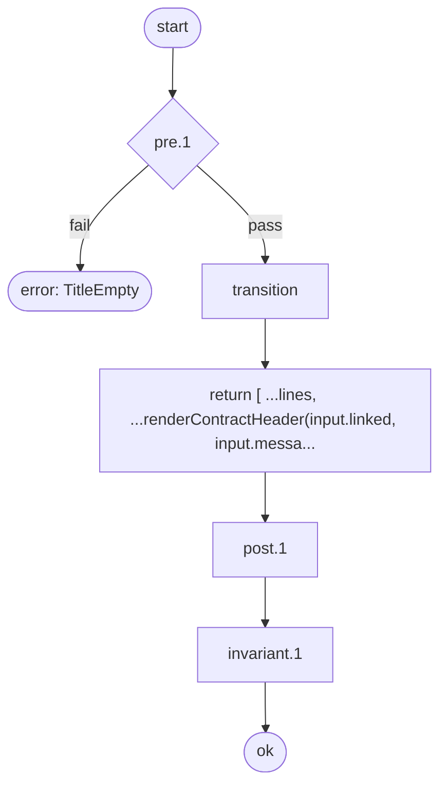

#### Flow Summary

| Metric | Value |
|---|---|
| Processing steps | 5 |
| Branch count | 0 |
| Error path count | 1 |
| Unanalyzable count | 0 |

### Preconditions

> Conditions that must be satisfied before this operation can execute. If a condition is not met, the corresponding error is returned.

| # | Condition | Error |
|---|------|--------|
| 1 | Contract ID must not be empty | `TitleEmpty` |

### Postconditions

> Conditions guaranteed to hold after this operation completes successfully.

| # | Condition |
|---|------|
| 1 | Output lines increase after header is added |

### Invariants

> Conditions that must hold both before and after this operation.

| # | Condition |
|---|------|
| 1 | Lines array is never negative length |

### Error Catalog

| Error Tag | Source |
|-----------|--------|
| `TitleEmpty` | Precondition #1 |

### Test Cases

> Test scenarios that verify the behavior of this operation.

| # | Scenario | Expected Result |
|---|---------|---------|
| 1 | renders contract header | Succeeds |
| 2 | rejects empty contract id | Returns error |
| 3 | post/invariant: hold after transition | - |

---

## render.coverageSummary

| Property | Type |
|------|-----|
| State | `readonly string[]` |
| Input | `CoverageSectionInput` |
| Error | `never` |

<!-- flow-hash: 03dde4b1c9f9071734d049803917b0865bfa8751a7947e5db456abdf02cca9fa -->

Flowchart (Mermaid)

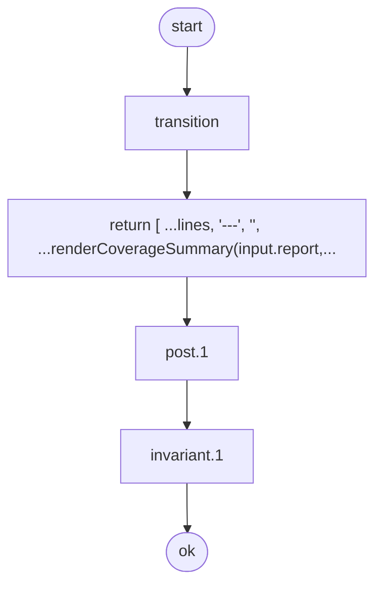

#### Flow Summary

| Metric | Value |
|---|---|
| Processing steps | 4 |
| Branch count | 0 |
| Error path count | 0 |
| Unanalyzable count | 0 |

### Preconditions

> Conditions that must be satisfied before this operation can execute. If a condition is not met, the corresponding error is returned.

_Not defined_

### Postconditions

> Conditions guaranteed to hold after this operation completes successfully.

| # | Condition |
|---|------|
| 1 | Output lines increase after coverage section |

### Invariants

> Conditions that must hold both before and after this operation.

| # | Condition |
|---|------|
| 1 | Lines array is never negative length |

### Error Catalog

_No errors defined_

### Test Cases

> Test scenarios that verify the behavior of this operation.

| # | Scenario | Expected Result |
|---|---------|---------|
| 1 | renders coverage summary | Succeeds |
| 2 | post/invariant: hold after transition | - |

---

## render.errorCatalog

| Property | Type |
|------|-----|
| State | `readonly string[]` |
| Input | `ErrorCatalogInput` |
| Error | `never` |

<!-- flow-hash: 61b82c0277b3cba814a93d15776ad0b0b5be075b658b6c95824daa23576e826e -->

Flowchart (Mermaid)

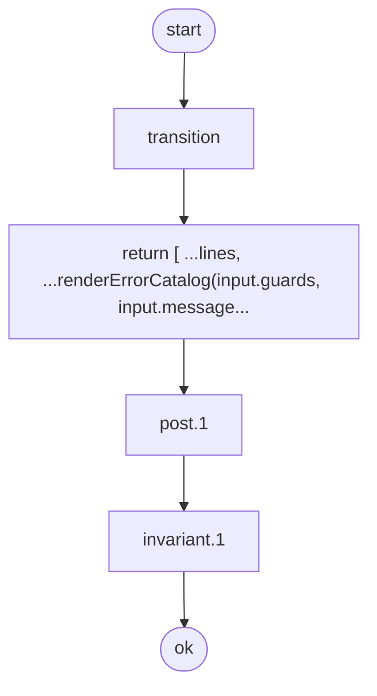

#### Flow Summary

| Metric | Value |
|---|---|
| Processing steps | 4 |
| Branch count | 0 |
| Error path count | 0 |
| Unanalyzable count | 0 |

### Preconditions

> Conditions that must be satisfied before this operation can execute. If a condition is not met, the corresponding error is returned.

_Not defined_

### Postconditions

> Conditions guaranteed to hold after this operation completes successfully.

| # | Condition |
|---|------|
| 1 | Output lines do not decrease |

### Invariants

> Conditions that must hold both before and after this operation.

| # | Condition |
|---|------|
| 1 | Lines array is never negative length |

### Error Catalog

_No errors defined_

### Test Cases

> Test scenarios that verify the behavior of this operation.

| # | Scenario | Expected Result |
|---|---------|---------|
| 1 | renders error catalog | Succeeds |
| 2 | renders empty error catalog | Succeeds |
| 3 | post/invariant: hold after transition | - |

---

## render.invariants

| Property | Type |
|------|-----|
| State | `readonly string[]` |
| Input | `InvariantsInput` |
| Error | `never` |

<!-- flow-hash: fc58915af6d4ac69d126b300b5bd62917bbc06a78b3b929728a49fb9c26c3486 -->

Flowchart (Mermaid)

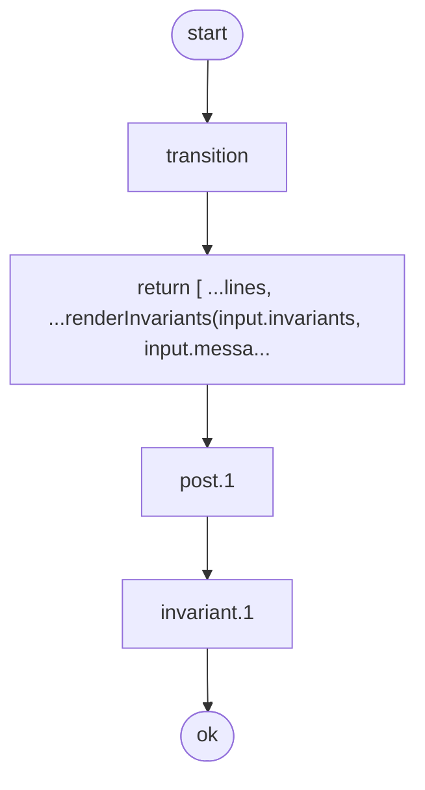

#### Flow Summary

| Metric | Value |
|---|---|
| Processing steps | 4 |
| Branch count | 0 |
| Error path count | 0 |
| Unanalyzable count | 0 |

### Preconditions

> Conditions that must be satisfied before this operation can execute. If a condition is not met, the corresponding error is returned.

_Not defined_

### Postconditions

> Conditions guaranteed to hold after this operation completes successfully.

| # | Condition |
|---|------|
| 1 | Output lines do not decrease |

### Invariants

> Conditions that must hold both before and after this operation.

| # | Condition |
|---|------|
| 1 | Lines array is never negative length |

### Error Catalog

_No errors defined_

### Test Cases

> Test scenarios that verify the behavior of this operation.

| # | Scenario | Expected Result |
|---|---------|---------|
| 1 | renders invariants | Succeeds |
| 2 | post/invariant: hold after transition | - |

---

## render.postconditions

| Property | Type |
|------|-----|
| State | `readonly string[]` |
| Input | `PostconditionsInput` |
| Error | `never` |

<!-- flow-hash: c7a6da79daa7c3d9c37af4acab3fc621a385fbf06c0e0e610fd7f592c3a2710a -->

Flowchart (Mermaid)

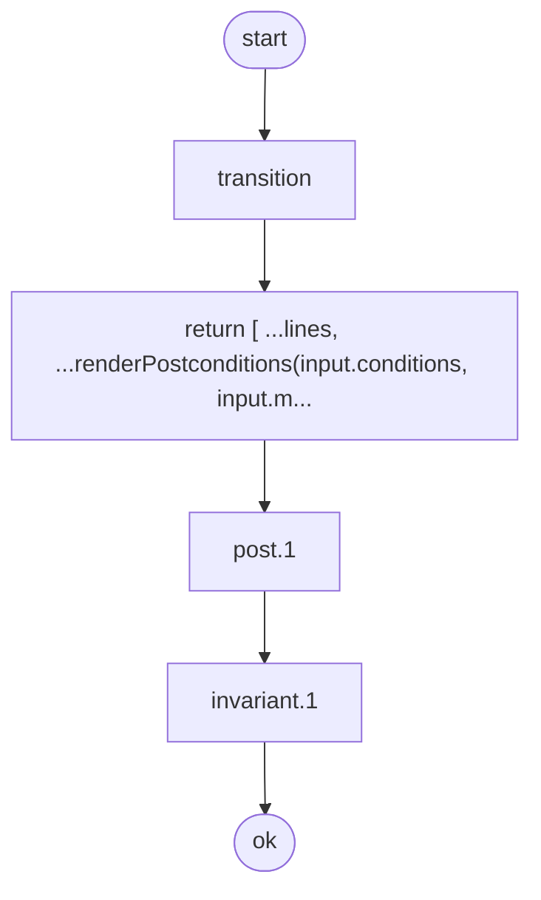

#### Flow Summary

| Metric | Value |
|---|---|
| Processing steps | 4 |
| Branch count | 0 |
| Error path count | 0 |
| Unanalyzable count | 0 |

### Preconditions

> Conditions that must be satisfied before this operation can execute. If a condition is not met, the corresponding error is returned.

_Not defined_

### Postconditions

> Conditions guaranteed to hold after this operation completes successfully.

| # | Condition |
|---|------|
| 1 | Output lines do not decrease |

### Invariants

> Conditions that must hold both before and after this operation.

| # | Condition |
|---|------|
| 1 | Lines array is never negative length |

### Error Catalog

_No errors defined_

### Test Cases

> Test scenarios that verify the behavior of this operation.

| # | Scenario | Expected Result |
|---|---------|---------|
| 1 | renders postconditions | Succeeds |
| 2 | post/invariant: hold after transition | - |

---

## render.preconditions

| Property | Type |
|------|-----|
| State | `readonly string[]` |
| Input | `PreconditionsInput` |
| Error | `never` |

<!-- flow-hash: b4d62255830673ee5bab20b0922ae452b0c21ea6c940b7c79d8b48f6ba6e2d18 -->

Flowchart (Mermaid)

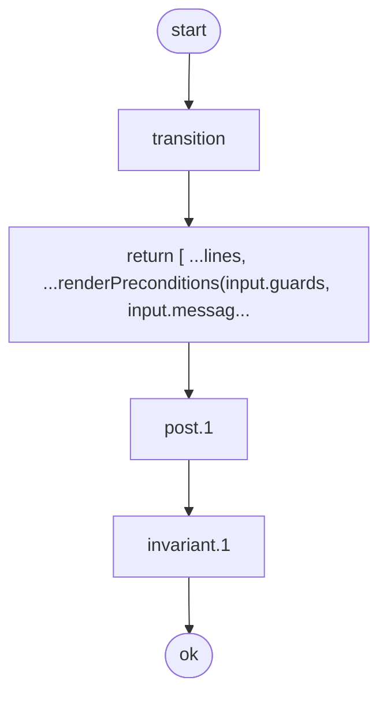

#### Flow Summary

| Metric | Value |
|---|---|
| Processing steps | 4 |
| Branch count | 0 |
| Error path count | 0 |
| Unanalyzable count | 0 |

### Preconditions

> Conditions that must be satisfied before this operation can execute. If a condition is not met, the corresponding error is returned.

_Not defined_

### Postconditions

> Conditions guaranteed to hold after this operation completes successfully.

| # | Condition |
|---|------|
| 1 | Output lines do not decrease |

### Invariants

> Conditions that must hold both before and after this operation.

| # | Condition |
|---|------|
| 1 | Lines array is never negative length |

### Error Catalog

_No errors defined_

### Test Cases

> Test scenarios that verify the behavior of this operation.

| # | Scenario | Expected Result |
|---|---------|---------|
| 1 | renders preconditions | Succeeds |
| 2 | renders empty preconditions | Succeeds |
| 3 | post/invariant: hold after transition | - |

---

## render.scenarioSection

| Property | Type |
|------|-----|
| State | `readonly string[]` |
| Input | `ScenarioSectionInput` |
| Error | `RenderError` |

<!-- flow-hash: fc82edc1a160ab15dc5794ff97818699c1a445a2316b7773a51a0d8e2100a124 -->

Flowchart (Mermaid)

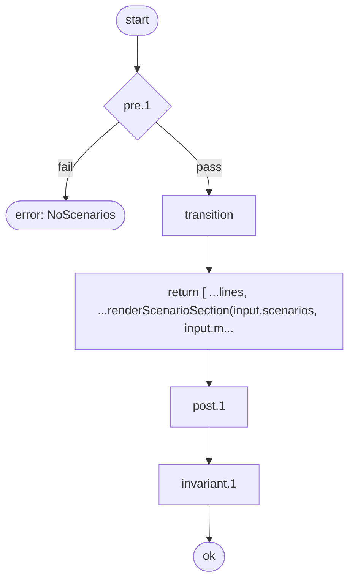

#### Flow Summary

| Metric | Value |
|---|---|
| Processing steps | 5 |
| Branch count | 0 |
| Error path count | 1 |
| Unanalyzable count | 0 |

### Preconditions

> Conditions that must be satisfied before this operation can execute. If a condition is not met, the corresponding error is returned.

| # | Condition | Error |
|---|------|--------|
| 1 | At least one scenario must exist | `NoScenarios` |

### Postconditions

> Conditions guaranteed to hold after this operation completes successfully.

| # | Condition |
|---|------|
| 1 | Output lines increase after scenario section |

### Invariants

> Conditions that must hold both before and after this operation.

| # | Condition |
|---|------|
| 1 | Lines array is never negative length |

### Error Catalog

| Error Tag | Source |
|-----------|--------|
| `NoScenarios` | Precondition #1 |

### Test Cases

> Test scenarios that verify the behavior of this operation.

| # | Scenario | Expected Result |
|---|---------|---------|
| 1 | renders scenario section | Succeeds |
| 2 | rejects empty scenarios | Returns error |
| 3 | post/invariant: hold after transition | - |

---

## render.testExamples

| Property | Type |
|------|-----|
| State | `readonly string[]` |
| Input | `TestExamplesInput` |
| Error | `never` |

<!-- flow-hash: f88c356f8561499d4c698e6ddf7c50054e1e5a345255f5a8d0d365c2ad599aa5 -->

Flowchart (Mermaid)

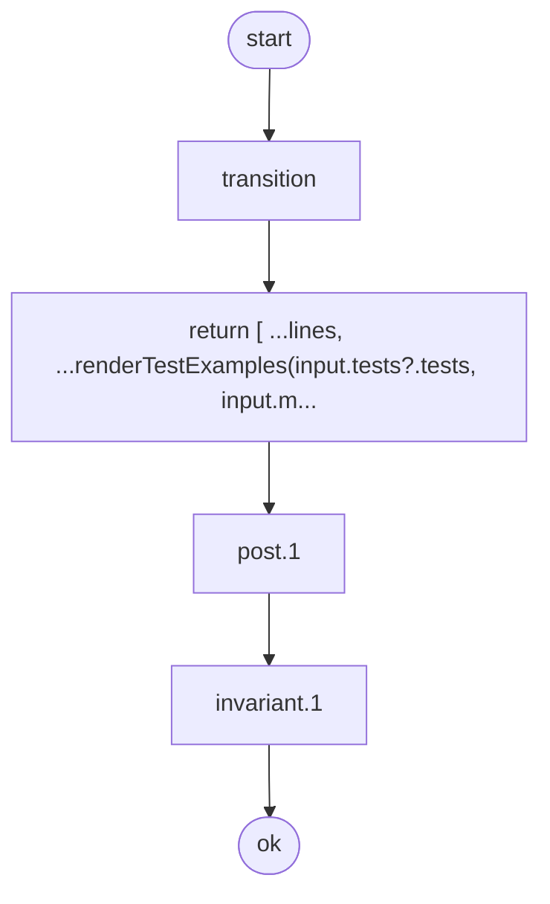

#### Flow Summary

| Metric | Value |
|---|---|
| Processing steps | 4 |
| Branch count | 0 |
| Error path count | 0 |
| Unanalyzable count | 0 |

### Preconditions

> Conditions that must be satisfied before this operation can execute. If a condition is not met, the corresponding error is returned.

_Not defined_

### Postconditions

> Conditions guaranteed to hold after this operation completes successfully.

| # | Condition |
|---|------|
| 1 | Output lines do not decrease |

### Invariants

> Conditions that must hold both before and after this operation.

| # | Condition |
|---|------|
| 1 | Lines array is never negative length |

### Error Catalog

_No errors defined_

### Test Cases

> Test scenarios that verify the behavior of this operation.

| # | Scenario | Expected Result |
|---|---------|---------|
| 1 | renders test examples | Succeeds |
| 2 | renders no tests message | Succeeds |
| 3 | post/invariant: hold after transition | - |

---

## render.title

| Property | Type |
|------|-----|
| State | `readonly string[]` |
| Input | `TitleInput` |
| Error | `RenderError` |

<!-- flow-hash: c420c0aa2bda89c654ba81184da666d4c71ef53c00820e154627d895cd4318cd -->

Flowchart (Mermaid)

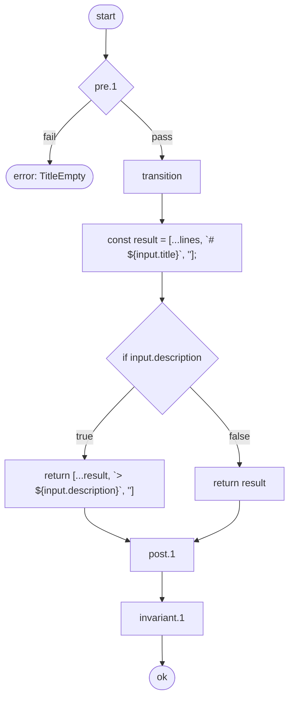

#### Flow Summary

| Metric | Value |
|---|---|
| Processing steps | 8 |
| Branch count | 1 |
| Error path count | 1 |
| Unanalyzable count | 0 |

### Preconditions

> Conditions that must be satisfied before this operation can execute. If a condition is not met, the corresponding error is returned.

| # | Condition | Error |
|---|------|--------|
| 1 | Title must not be empty | `TitleEmpty` |

### Postconditions

> Conditions guaranteed to hold after this operation completes successfully.

| # | Condition |
|---|------|
| 1 | Output lines increase after title is added |

### Invariants

> Conditions that must hold both before and after this operation.

| # | Condition |
|---|------|
| 1 | Lines array is never negative length |

### Error Catalog

| Error Tag | Source |
|-----------|--------|
| `TitleEmpty` | Precondition #1 |

### Test Cases

> Test scenarios that verify the behavior of this operation.

| # | Scenario | Expected Result |
|---|---------|---------|
| 1 | renders title with description | Succeeds |
| 2 | renders title without description | Succeeds |
| 3 | rejects empty title | Returns error |
| 4 | preserves existing lines | Succeeds |
| 5 | post: lines increase after transition | - |
| 6 | invariant: holds on result state | - |

---

## render.toc

| Property | Type |
|------|-----|
| State | `readonly string[]` |
| Input | `TocInput` |
| Error | `RenderError` |

<!-- flow-hash: 0da6118f87e539a2946ea7f98104ae6bab656d4c372d27d4c143555ae85e3728 -->

Flowchart (Mermaid)

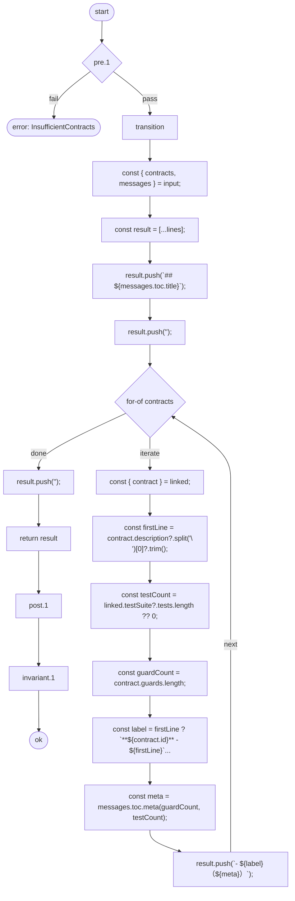

#### Flow Summary

| Metric | Value |
|---|---|
| Processing steps | 18 |
| Branch count | 1 |
| Error path count | 1 |
| Unanalyzable count | 0 |

### Preconditions

> Conditions that must be satisfied before this operation can execute. If a condition is not met, the corresponding error is returned.

| # | Condition | Error |
|---|------|--------|
| 1 | At least 2 contracts are required for table of contents | `InsufficientContracts` |

### Postconditions

> Conditions guaranteed to hold after this operation completes successfully.

| # | Condition |
|---|------|
| 1 | Output lines increase after TOC is added |

### Invariants

> Conditions that must hold both before and after this operation.

| # | Condition |
|---|------|
| 1 | Lines array is never negative length |

### Error Catalog

| Error Tag | Source |
|-----------|--------|
| `InsufficientContracts` | Precondition #1 |

### Test Cases

> Test scenarios that verify the behavior of this operation.

| # | Scenario | Expected Result |
|---|---------|---------|
| 1 | renders TOC for 2+ contracts | Succeeds |
| 2 | rejects fewer than 2 contracts | Returns error |
| 3 | post/invariant: hold after transition | - |

---

## report.replay

| Property | Type |
|------|-----|
| State | `string` |
| Input | `ReporterInput` |
| Error | `ReporterError` |

<!-- flow-hash: d47af9155b438b11d68a4c285a94150400c6349fb5699b66b8f45dd117efd881 -->

Flowchart (Mermaid)

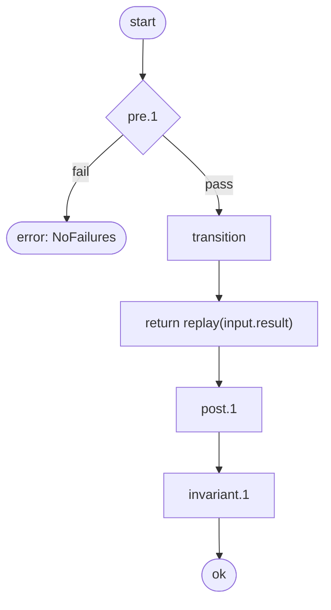

#### Flow Summary

| Metric | Value |
|---|---|
| Processing steps | 5 |
| Branch count | 0 |
| Error path count | 1 |
| Unanalyzable count | 0 |

### Preconditions

> Conditions that must be satisfied before this operation can execute. If a condition is not met, the corresponding error is returned.

| # | Condition | Error |
|---|------|--------|
| 1 | Must have at least one failure to generate replay | `NoFailures` |

### Postconditions

> Conditions guaranteed to hold after this operation completes successfully.

| # | Condition |
|---|------|
| 1 | Output is non-empty |

### Invariants

> Conditions that must hold both before and after this operation.

| # | Condition |
|---|------|
| 1 | Output is always a string |

### Error Catalog

| Error Tag | Source |
|-----------|--------|
| `NoFailures` | Precondition #1 |

### Test Cases

> Test scenarios that verify the behavior of this operation.

| # | Scenario | Expected Result |
|---|---------|---------|
| 1 | formats failed result | Succeeds |
| 2 | rejects successful result | Returns error |
| 3 | post/invariant: hold after transition | - |
| 4 | exposes contract metadata | - |

---

## report.summary

| Property | Type |
|------|-----|
| State | `string` |
| Input | `ReporterInput` |
| Error | `ReporterError` |

<!-- flow-hash: bc3405c86a23f1da2a7409da623a194c92ea129b0dfac44e3227a043c82106f8 -->

Flowchart (Mermaid)

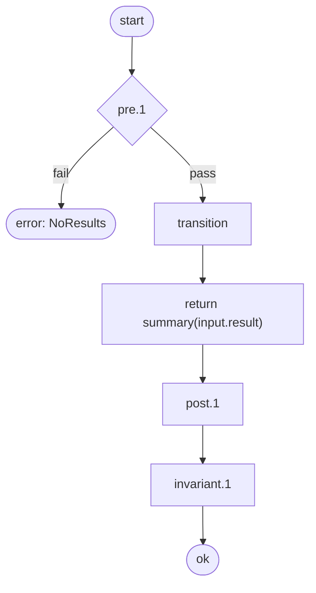

#### Flow Summary

| Metric | Value |
|---|---|
| Processing steps | 5 |
| Branch count | 0 |
| Error path count | 1 |
| Unanalyzable count | 0 |

### Preconditions

> Conditions that must be satisfied before this operation can execute. If a condition is not met, the corresponding error is returned.

| # | Condition | Error |
|---|------|--------|
| 1 | Verification results must not be empty | `NoResults` |

### Postconditions

> Conditions guaranteed to hold after this operation completes successfully.

| # | Condition |
|---|------|
| 1 | Output contains kata-verify header |

### Invariants

> Conditions that must hold both before and after this operation.

| # | Condition |
|---|------|
| 1 | Output is always a string |

### Error Catalog

| Error Tag | Source |
|-----------|--------|
| `NoResults` | Precondition #1 |

### Test Cases

> Test scenarios that verify the behavior of this operation.

| # | Scenario | Expected Result |
|---|---------|---------|
| 1 | formats passing result | Succeeds |
| 2 | formats result with multiple contracts | Succeeds |
| 3 | rejects empty results | Returns error |
| 4 | post/invariant: hold after transition | - |
| 5 | exposes contract metadata | - |

---

## Test Coverage

> Test coverage status for each contract.

| Contract | Tests | Error Tag Coverage | Status |
|----------|-------|---------------|--------|
| doc.parse | 6 | 0/1 | Tested |
| doc.filter | 4 | - | Tested |
| doc.link | 2 | - | Tested |
| doc.analyze | 4 | - | Tested |
| doc.render | 3 | - | Tested |
| render.title | 6 | 0/1 | Tested |
| render.toc | 3 | 0/1 | Tested |
| render.scenarioSection | 3 | 0/1 | Tested |
| render.contractHeader | 3 | 0/1 | Tested |
| render.preconditions | 3 | - | Tested |
| render.postconditions | 2 | - | Tested |
| render.invariants | 2 | - | Tested |
| render.errorCatalog | 3 | - | Tested |
| render.testExamples | 3 | - | Tested |
| render.coverageSummary | 2 | - | Tested |
| render.contractDetail | 5 | - | Tested |
| report.summary | 5 | 0/1 | Tested |
| report.replay | 4 | 0/1 | Tested |

Contract coverage: 18/18 (100.0%)
Error tag coverage: 0/7 (0.0%)
