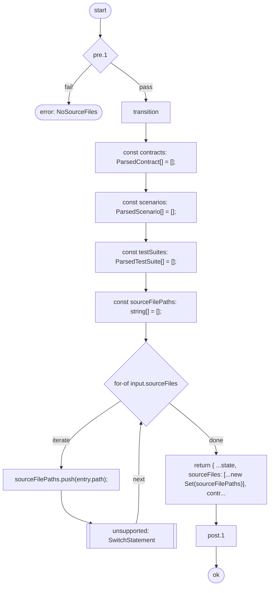
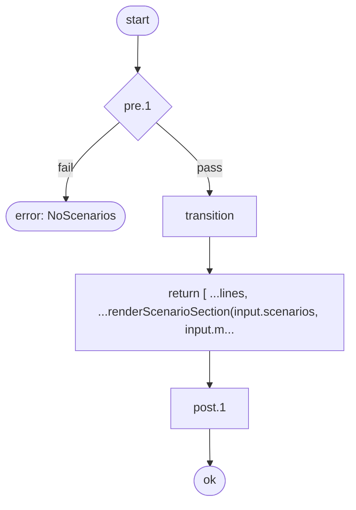
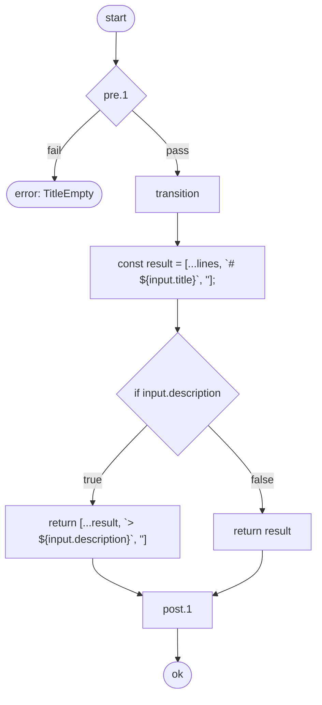
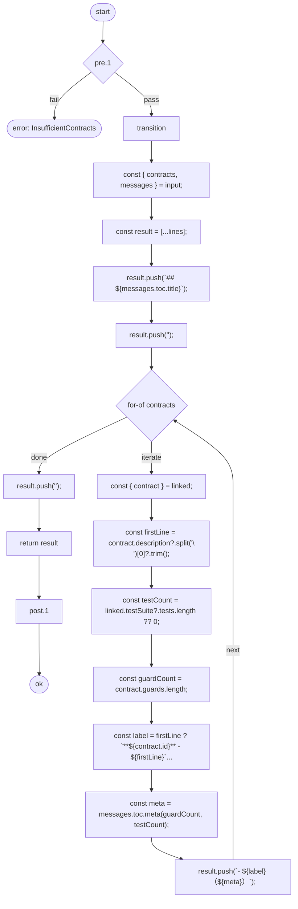

# kata-cli Contract Specification

> kata-cli domain logic contracts — self-documenting dogfooding example

## Scenarios

> Business workflows composed from multiple contract operations.

### ドキュメント生成パイプライン

> `doc.generate`

### Acceptance Criteria

> Business requirements that this contract fulfills.

- ソースファイルからContract仕様書を自動生成できる

| # | Operation | Input |
|---|------|------|
| 1 | `doc.parse` | sourceFiles: input.sourceFiles |
| 2 | `doc.filter` | filterIds: input.filterIds |
| 3 | `doc.link` | - |
| 4 | `doc.analyze` | enabled: input.coverageEnabled |
| 5 | `doc.render` | - |

<!-- flow-hash: e2aa910ce0e8b6c8994bc92f6872b816f8d6ea26f7315b895eb86d20e89922c4 -->

Flowchart (Mermaid)

#### Flow Summary

| Metric | Value |
|---|---|
| Processing steps | 5 |
| Branch count | 0 |
| Error path count | 0 |
| Unanalyzable count | 0 |

### カバレッジ分析パイプライン

> `coverage.generate`

### Acceptance Criteria

> Business requirements that this contract fulfills.

- テストカバレッジレポートを生成できる

| # | Operation | Input |
|---|------|------|
| 1 | `doc.parse` | sourceFiles: input.sourceFiles |
| 2 | `doc.filter` | filterIds: input.filterIds |
| 3 | `doc.link` | - |
| 4 | `doc.analyze` | enabled: true |

<!-- flow-hash: dc55991c965b071f2945f019362a697d104a6dde190695344657250eb7ca5424 -->

Flowchart (Mermaid)

#### Flow Summary

| Metric | Value |
|---|---|
| Processing steps | 4 |
| Branch count | 0 |
| Error path count | 0 |
| Unanalyzable count | 0 |

### Markdown ドキュメントの前半組み立て

> `render.markdown`

### Acceptance Criteria

> Business requirements that this contract fulfills.

- タイトル・シナリオ・目次をMarkdownとして組み立てられる

| # | Operation | Input |
|---|------|------|
| 1 | `render.title` | title: input.title, description: input.description |
| 2 | `render.scenarioSection` | scenarios: input.scenarios, messages: input.messages, flowEnabled: input.flowEnabled |
| 3 | `render.toc` | contracts: sorted, messages: input.messages |

<!-- flow-hash: fd82a19d02f2f6113cf5e913abe609866ed3bf73a16e3b02bd09ecdc5b6aa481 -->

Flowchart (Mermaid)

#### Flow Summary

| Metric | Value |
|---|---|
| Processing steps | 5 |
| Branch count | 2 |
| Error path count | 0 |
| Unanalyzable count | 0 |

## Table of Contents

- **doc.analyze** （Preconditions: 0, Tests: 4）
- **doc.filter** （Preconditions: 0, Tests: 4）
- **doc.link** （Preconditions: 0, Tests: 2）
- **doc.parse** （Preconditions: 1, Tests: 6）
- **doc.render** （Preconditions: 0, Tests: 3）
- **render.scenarioSection** （Preconditions: 1, Tests: 2）
- **render.title** （Preconditions: 1, Tests: 3）
- **render.toc** （Preconditions: 1, Tests: 3）
- **report.replay** （Preconditions: 1, Tests: 4）
- **report.summary** （Preconditions: 1, Tests: 5）

---

## Contract Details

---

## doc.analyze

### Acceptance Criteria

> Business requirements that this contract fulfills.

- テストカバレッジを分析してレポートを生成できる

| Property | Type |
|------|-----|
| State | `DocPipelineState` |
| Input | `AnalyzeInput` |
| Error | `never` |

<!-- flow-hash: 41aa4524f7302e91f31bf9133af3a4d1b34a71ee1f05dc834c58bfae2a38a3b3 -->

Flowchart (Mermaid)

#### Flow Summary

| Metric | Value |
|---|---|
| Processing steps | 6 |
| Branch count | 1 |
| Error path count | 0 |
| Unanalyzable count | 0 |

### Preconditions

> Conditions that must be satisfied before this operation can execute. If a condition is not met, the corresponding error is returned.

_Not defined_

### Postconditions

> Conditions guaranteed to hold after this operation completes successfully.

| # | Condition |
|---|------|
| 1 | Coverage report is present when analysis is enabled |

### Invariants

> Conditions that must hold both before and after this operation.

_Not defined_

### Error Catalog

_No errors defined_

### Test Cases

> Test scenarios that verify the behavior of this operation.

| # | Scenario | Expected Result |
|---|---------|---------|
| 1 | generates coverage report when enabled | Succeeds |
| 2 | skips coverage when disabled | Succeeds |
| 3 | post/invariant: hold when enabled | Succeeds |
| 4 | post/invariant: hold when disabled | Succeeds |

---

## doc.filter

### Acceptance Criteria

> Business requirements that this contract fulfills.

- 指定されたIDでContractをフィルタリングできる

| Property | Type |
|------|-----|
| State | `DocPipelineState` |
| Input | `FilterInput` |
| Error | `never` |

<!-- flow-hash: 3225329e243f73cc9b79acccd0841fa71fcfa8fabbf564e8e659ea6faf930bbf -->

Flowchart (Mermaid)

#### Flow Summary

| Metric | Value |
|---|---|
| Processing steps | 5 |
| Branch count | 1 |
| Error path count | 0 |
| Unanalyzable count | 0 |

### Preconditions

> Conditions that must be satisfied before this operation can execute. If a condition is not met, the corresponding error is returned.

_Not defined_

### Postconditions

> Conditions guaranteed to hold after this operation completes successfully.

| # | Condition |
|---|------|
| 1 | Filtered contracts are a subset of all contracts |

### Invariants

> Conditions that must hold both before and after this operation.

_Not defined_

### Error Catalog

_No errors defined_

### Test Cases

> Test scenarios that verify the behavior of this operation.

| # | Scenario | Expected Result |
|---|---------|---------|
| 1 | filters contracts by IDs | Succeeds |
| 2 | passes all contracts when no filter | Succeeds |
| 3 | returns empty when filter matches nothing | Succeeds |
| 4 | post/invariant: hold after transition | Succeeds |

---

## doc.link

### Acceptance Criteria

> Business requirements that this contract fulfills.

- Contractとテストスイートを紐付けできる

| Property | Type |
|------|-----|
| State | `DocPipelineState` |
| Input | `Record<string, never>` |
| Error | `never` |

<!-- flow-hash: 1a4eefd6f3f3cc1c3bd189690b70b805e5b4ee7bde32777c1ea0682823149ecd -->

Flowchart (Mermaid)

#### Flow Summary

| Metric | Value |
|---|---|
| Processing steps | 5 |
| Branch count | 0 |
| Error path count | 0 |
| Unanalyzable count | 0 |

### Preconditions

> Conditions that must be satisfied before this operation can execute. If a condition is not met, the corresponding error is returned.

_Not defined_

### Postconditions

> Conditions guaranteed to hold after this operation completes successfully.

| # | Condition |
|---|------|
| 1 | Every filtered contract has a corresponding linked entry |

### Invariants

> Conditions that must hold both before and after this operation.

_Not defined_

### Error Catalog

_No errors defined_

### Test Cases

> Test scenarios that verify the behavior of this operation.

| # | Scenario | Expected Result |
|---|---------|---------|
| 1 | links contracts to tests | Succeeds |
| 2 | post/invariant: hold after transition | Succeeds |

---

## doc.parse

### Acceptance Criteria

> Business requirements that this contract fulfills.

- ソースファイルからContract・Scenario・テストをパースできる
- ソースファイルが未指定の場合はエラーを返す

| Property | Type |
|------|-----|
| State | `DocPipelineState` |
| Input | `ParseInput` |
| Error | `PipelineError` |

<!-- flow-hash: d6b549774871468f32c9f4e28358ae1e97fc57fe32dea87f596b3991096e752d -->

Flowchart (Mermaid)

#### Flow Summary

| Metric | Value |
|---|---|
| Processing steps | 10 |
| Branch count | 1 |
| Error path count | 1 |
| Unanalyzable count | 1 |

> Warning: 1 unsupported syntax path(s) were detected.

### Preconditions

> Conditions that must be satisfied before this operation can execute. If a condition is not met, the corresponding error is returned.

| # | Condition | Error |
|---|------|--------|
| 1 | Source files must not be empty | `NoSourceFiles` |

### Postconditions

> Conditions guaranteed to hold after this operation completes successfully.

| # | Condition |
|---|------|
| 1 | Source file paths are tracked uniquely in the pipeline state. |

### Invariants

> Conditions that must hold both before and after this operation.

_Not defined_

### Error Catalog

| Error Tag | Source |
|-----------|--------|
| `NoSourceFiles` | Precondition #1 |

### Test Cases

> Test scenarios that verify the behavior of this operation.

| # | Scenario | Expected Result |
|---|---------|---------|
| 1 | parses contracts from source files | Succeeds |
| 2 | parses test suites from source files | Succeeds |
| 3 | rejects empty source files | Returns error |
| 4 | preserves title and messages | Succeeds |
| 5 | post/invariant: hold after transition | - |
| 6 | exposes contract metadata | - |

---

## doc.render

### Acceptance Criteria

> Business requirements that this contract fulfills.

- パイプライン状態からMarkdownドキュメントを生成できる

| Property | Type |
|------|-----|
| State | `DocPipelineState` |
| Input | `Record<string, never>` |
| Error | `never` |

<!-- flow-hash: bb23750cbbe2e4dad5afd6605477107d7163c71182fc9908b1e89af8c6593565 -->

Flowchart (Mermaid)

#### Flow Summary

| Metric | Value |
|---|---|
| Processing steps | 9 |
| Branch count | 2 |
| Error path count | 1 |
| Unanalyzable count | 0 |

### Preconditions

> Conditions that must be satisfied before this operation can execute. If a condition is not met, the corresponding error is returned.

_Not defined_

### Postconditions

> Conditions guaranteed to hold after this operation completes successfully.

| # | Condition |
|---|------|
| 1 | Non-empty linked state produces non-empty markdown |

### Invariants

> Conditions that must hold both before and after this operation.

_Not defined_

### Error Catalog

_No errors defined_

### Test Cases

> Test scenarios that verify the behavior of this operation.

| # | Scenario | Expected Result |
|---|---------|---------|
| 1 | renders markdown from linked state | Succeeds |
| 2 | renders title-only markdown for empty state | Succeeds |
| 3 | post/invariant: hold after transition | Succeeds |

---

## render.scenarioSection

### Acceptance Criteria

> Business requirements that this contract fulfills.

- シナリオセクションをレンダリングできる

| Property | Type |
|------|-----|
| State | `readonly string[]` |
| Input | `ScenarioSectionInput` |
| Error | `RenderError` |

<!-- flow-hash: c7b1e7f43bc620aa63d105b6c41c9093b8c2d2699370dc2e451b51c3876fc278 -->

Flowchart (Mermaid)

#### Flow Summary

| Metric | Value |
|---|---|
| Processing steps | 4 |
| Branch count | 0 |
| Error path count | 1 |
| Unanalyzable count | 0 |

### Preconditions

> Conditions that must be satisfied before this operation can execute. If a condition is not met, the corresponding error is returned.

| # | Condition | Error |
|---|------|--------|
| 1 | Scenario section requires at least one parsed scenario. | `NoScenarios` |

### Postconditions

> Conditions guaranteed to hold after this operation completes successfully.

| # | Condition |
|---|------|
| 1 | Rendering scenario section appends lines to the existing output. |

### Invariants

> Conditions that must hold both before and after this operation.

_Not defined_

### Error Catalog

| Error Tag | Source |
|-----------|--------|
| `NoScenarios` | Precondition #1 |

### Test Cases

> Test scenarios that verify the behavior of this operation.

| # | Scenario | Expected Result |
|---|---------|---------|
| 1 | renders scenario section | Succeeds |
| 2 | rejects empty scenarios | Returns error |

---

## render.title

### Acceptance Criteria

> Business requirements that this contract fulfills.

- ドキュメントのタイトルと説明をレンダリングできる

| Property | Type |
|------|-----|
| State | `readonly string[]` |
| Input | `TitleInput` |
| Error | `RenderError` |

<!-- flow-hash: 83c828d53c57431d9da7985f7fd7e8a106685ab8e72a77642ca974149cee3bb4 -->

Flowchart (Mermaid)

#### Flow Summary

| Metric | Value |
|---|---|
| Processing steps | 7 |
| Branch count | 1 |
| Error path count | 1 |
| Unanalyzable count | 0 |

### Preconditions

> Conditions that must be satisfied before this operation can execute. If a condition is not met, the corresponding error is returned.

| # | Condition | Error |
|---|------|--------|
| 1 | Document title must not be empty. | `TitleEmpty` |

### Postconditions

> Conditions guaranteed to hold after this operation completes successfully.

| # | Condition |
|---|------|
| 1 | Rendering a title always appends new lines. |

### Invariants

> Conditions that must hold both before and after this operation.

_Not defined_

### Error Catalog

| Error Tag | Source |
|-----------|--------|
| `TitleEmpty` | Precondition #1 |

### Test Cases

> Test scenarios that verify the behavior of this operation.

| # | Scenario | Expected Result |
|---|---------|---------|
| 1 | renders title with description | Succeeds |
| 2 | rejects empty title | Returns error |
| 3 | post: lines increase after transition | - |

---

## render.toc

### Acceptance Criteria

> Business requirements that this contract fulfills.

- 2つ以上のContractがある場合に目次を生成できる

| Property | Type |
|------|-----|
| State | `readonly string[]` |
| Input | `TocInput` |
| Error | `RenderError` |

<!-- flow-hash: 16369dd201036ae39236b0136501a4e3c70d0f7c1e93482c0b516355972197d8 -->

Flowchart (Mermaid)

#### Flow Summary

| Metric | Value |
|---|---|
| Processing steps | 17 |
| Branch count | 1 |
| Error path count | 1 |
| Unanalyzable count | 0 |

### Preconditions

> Conditions that must be satisfied before this operation can execute. If a condition is not met, the corresponding error is returned.

| # | Condition | Error |
|---|------|--------|
| 1 | TOC is meaningful only when two or more contracts are present. | `InsufficientContracts` |

### Postconditions

> Conditions guaranteed to hold after this operation completes successfully.

| # | Condition |
|---|------|
| 1 | Rendering TOC appends lines to the existing output. |

### Invariants

> Conditions that must hold both before and after this operation.

_Not defined_

### Error Catalog

| Error Tag | Source |
|-----------|--------|
| `InsufficientContracts` | Precondition #1 |

### Test Cases

> Test scenarios that verify the behavior of this operation.

| # | Scenario | Expected Result |
|---|---------|---------|
| 1 | renders TOC for 2+ contracts | Succeeds |
| 2 | rejects fewer than 2 contracts | Returns error |
| 3 | post: lines increase after transition | - |

---

## report.replay

### Acceptance Criteria

> Business requirements that this contract fulfills.

- 失敗したPBT検証のリプレイコマンドを生成できる

| Property | Type |
|------|-----|
| State | `string` |
| Input | `ReporterInput` |
| Error | `ReporterError` |

<!-- flow-hash: d47af9155b438b11d68a4c285a94150400c6349fb5699b66b8f45dd117efd881 -->

Flowchart (Mermaid)

#### Flow Summary

| Metric | Value |
|---|---|
| Processing steps | 5 |
| Branch count | 0 |
| Error path count | 1 |
| Unanalyzable count | 0 |

### Preconditions

> Conditions that must be satisfied before this operation can execute. If a condition is not met, the corresponding error is returned.

| # | Condition | Error |
|---|------|--------|
| 1 | Must have at least one failure to generate replay | `NoFailures` |

### Postconditions

> Conditions guaranteed to hold after this operation completes successfully.

| # | Condition |
|---|------|
| 1 | Output is non-empty |

### Invariants

> Conditions that must hold both before and after this operation.

| # | Condition |
|---|------|
| 1 | Output is always a string |

### Error Catalog

| Error Tag | Source |
|-----------|--------|
| `NoFailures` | Precondition #1 |

### Test Cases

> Test scenarios that verify the behavior of this operation.

| # | Scenario | Expected Result |
|---|---------|---------|
| 1 | formats failed result | Succeeds |
| 2 | rejects successful result | Returns error |
| 3 | post/invariant: hold after transition | - |
| 4 | exposes contract metadata | - |

---

## report.summary

### Acceptance Criteria

> Business requirements that this contract fulfills.

- PBT検証結果のサマリーレポートを生成できる

| Property | Type |
|------|-----|
| State | `string` |
| Input | `ReporterInput` |
| Error | `ReporterError` |

<!-- flow-hash: bc3405c86a23f1da2a7409da623a194c92ea129b0dfac44e3227a043c82106f8 -->

Flowchart (Mermaid)

#### Flow Summary

| Metric | Value |
|---|---|
| Processing steps | 5 |
| Branch count | 0 |
| Error path count | 1 |
| Unanalyzable count | 0 |

### Preconditions

> Conditions that must be satisfied before this operation can execute. If a condition is not met, the corresponding error is returned.

| # | Condition | Error |
|---|------|--------|
| 1 | Verification results must not be empty | `NoResults` |

### Postconditions

> Conditions guaranteed to hold after this operation completes successfully.

| # | Condition |
|---|------|
| 1 | Output contains kata-verify header |

### Invariants

> Conditions that must hold both before and after this operation.

| # | Condition |
|---|------|
| 1 | Output is always a string |

### Error Catalog

| Error Tag | Source |
|-----------|--------|
| `NoResults` | Precondition #1 |

### Test Cases

> Test scenarios that verify the behavior of this operation.

| # | Scenario | Expected Result |
|---|---------|---------|
| 1 | formats passing result | Succeeds |
| 2 | formats result with multiple contracts | Succeeds |
| 3 | rejects empty results | Returns error |
| 4 | post/invariant: hold after transition | - |
| 5 | exposes contract metadata | - |

---

## Test Coverage

> Test coverage status for each contract.

| Contract | Tests | Error Tag Coverage | Status |
|----------|-------|---------------|--------|
| doc.parse | 6 | 0/1 | Tested |
| doc.filter | 4 | - | Tested |
| doc.link | 2 | - | Tested |
| doc.analyze | 4 | - | Tested |
| doc.render | 3 | - | Tested |
| render.title | 3 | 0/1 | Tested |
| render.toc | 3 | 0/1 | Tested |
| render.scenarioSection | 2 | 0/1 | Tested |
| report.summary | 5 | 0/1 | Tested |
| report.replay | 4 | 0/1 | Tested |

Contract coverage: 10/10 (100.0%)
Error tag coverage: 0/6 (0.0%)
